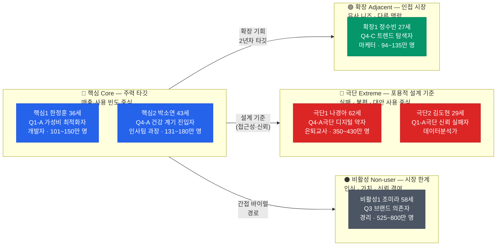
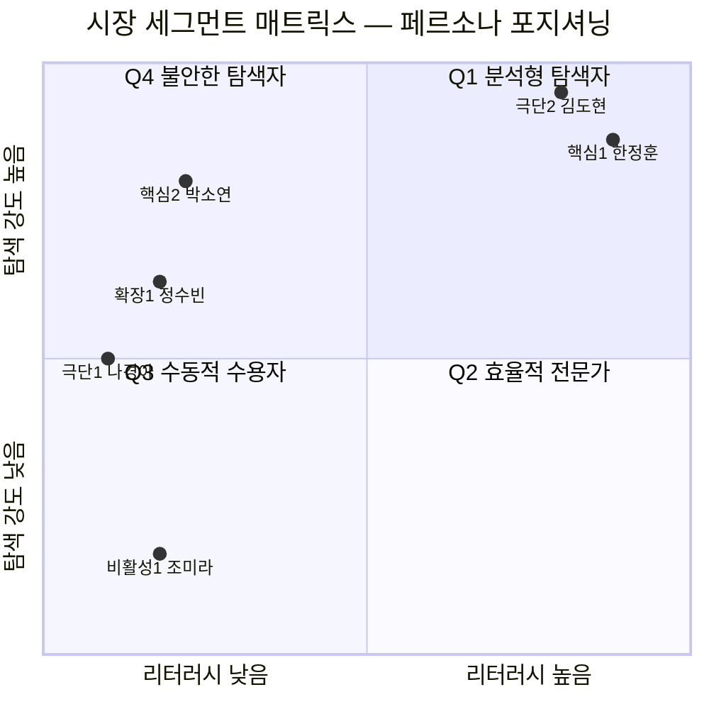
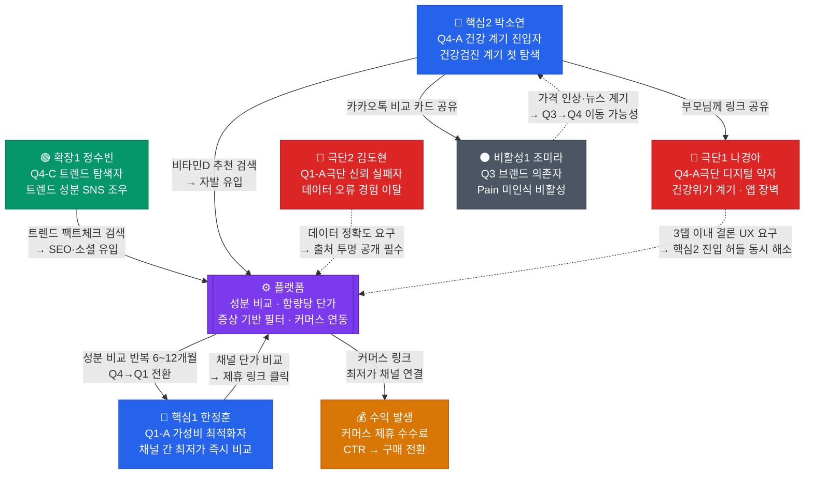
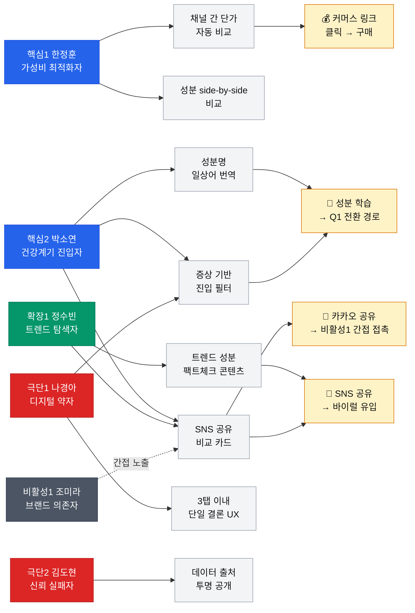
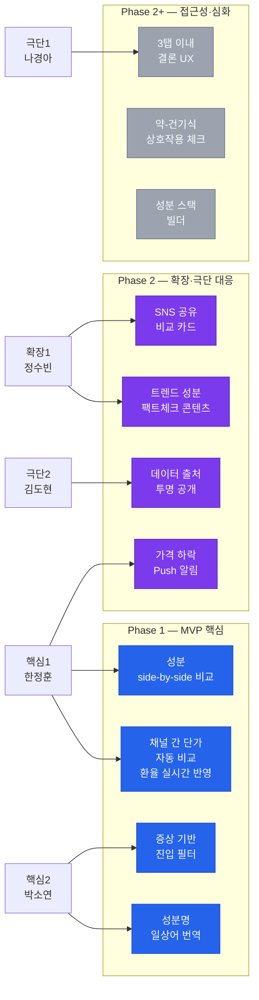
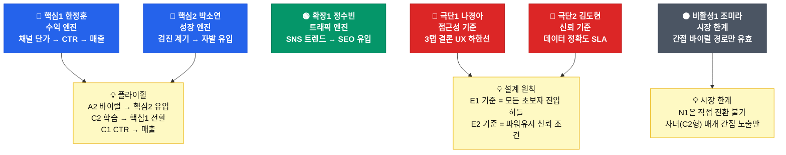

# Persona Spectrum Map — 건강보조식품 성분·가격 비교 플랫폼

> **문서 목적:** 페르소나 스펙트럼 작성 5단계(방법론) 최종 산출물.
> 1→12명 초안 → 2→6명 필터링 → 3→4종 카드 → 4→실재 검증을 거친 페르소나 간 관계를 구조화하고 시각화한다.
>
> **수록 맵:** Map 1 스펙트럼 전체 구조 / Map 2 시장 세그먼트 매트릭스 / Map 3 전환·바이럴 흐름도 / Map 4 플랫폼 접점 모델 / Map 5 제품 설계 우선순위

---

## Map 1 · 페르소나 스펙트럼 전체 구조

> **읽는 법:** 왼쪽(핵심)에서 오른쪽(비활성)으로 갈수록 플랫폼 자발 유입 가능성이 낮아지고, 설계·전략적 함의가 달라진다.

---

## Map 2 · 시장 세그먼트 매트릭스 포지셔닝

> **읽는 법:** X축은 성분 리터러시(낮음→높음), Y축은 정보 탐색 강도(낮음→높음). 4개 사분면이 Q1~Q4 세그먼트에 대응. 각 페르소나의 좌표는 세그먼트 분석 기반 추정값.

### 매트릭스 해설

| 사분면 | 세그먼트명 | 위치한 페르소나 | 전략 방향 |
|---|---|---|---|
| **Q1 (우상단)** | 분석형 탐색자 | 핵심1 한정훈, 극단2 김도현(극단) | 수익 엔진 — 함량당 단가·채널 비교 도구 |
| **Q4 (좌상단)** | 불안한 탐색자 | 핵심2 박소연, 확장1 정수빈, 극단1 나경아(극단) | 성장 엔진 — 단순화·신뢰·진입 장벽 제거 |
| **Q2 (우하단)** | 효율적 전문가 | (A3 오영철 — Phase 2) | Push 알림 기반 찾아가는 서비스 |
| **Q3 (좌하단)** | 수동적 수용자 | 비활성1 조미라 | 직접 전환 불가 — 간접 바이럴만 유효 |

---

## Map 3 · 전환·바이럴 흐름도

> **읽는 법:** 실선 화살표는 직접 행동 경로, 점선 화살표는 설계 요구사항 영향 관계. 플랫폼이 허브 역할을 하며 각 페르소나의 진입·이탈·전환 흐름을 보여준다.

### 흐름도 핵심 동선 해설

| 동선 | 설명 | 전략적 의미 |
|---|---|---|
| **확장1 → 플랫폼 → 핵심2** | A2가 공유한 SNS 비교 카드가 C2의 첫 유입 경로가 됨 | 확장 사용자가 핵심 사용자를 끌어오는 바이럴 구조 |
| **핵심2 → 플랫폼 → 핵심1** | Q4 사용자가 반복 사용으로 Q1으로 전환 (6~12개월) | 플랫폼의 성장 플라이휠 — LTV 증가의 핵심 경로 |
| **핵심1 → 플랫폼 → 수익** | 전환율 가장 높은 사용자의 커머스 클릭 | 1년차 SOM 기본 시나리오 매출의 55% 기여 |
| **핵심2 → 비활성1 (간접)** | 비교 카드를 카카오톡으로 공유 | 비활성 사용자의 유일한 접점 — 직접 전환 아닌 인식 노출 |
| **극단2 ⇢ 플랫폼** | 데이터 오류 경험자의 신뢰 요구 | 데이터 정확도 SLA 설계의 강제 기준 |
| **극단1 ⇢ 플랫폼** | 3탭 이내 결론 UX 요구 | 접근성 설계가 핵심2 초보 UX에도 직접 적용됨 |

---

## Map 4 · 플랫폼 접점 모델

> **읽는 법:** 각 페르소나가 플랫폼의 어떤 기능과 접점을 갖는지, 그 결과로 어떤 행동이 발생하는지를 보여준다. 기능 개발 우선순위 판단에 직접 사용.

---

## Map 5 · 제품 설계 우선순위 매핑

### Phase 1 MVP 기능 (핵심1 + 핵심2 중심)

### 기능-페르소나 매핑 종합표

| 기능 | 핵심1 한정훈 | 핵심2 박소연 | 확장1 정수빈 | 극단1 나경아 | 극단2 김도현 | 비활성1 조미라 | Phase |
|---|---|---|---|---|---|---|---|
| 채널 간 단가 자동 비교 (환율) | ★★★★★ | ★★★ | ★★★ | ★ | ★★★★ | — | **1** |
| 성분 side-by-side 비교 | ★★★★★ | ★★★★ | ★★★★ | ★★ | ★★★★★ | — | **1** |
| 성분명 일상어 번역 | ★ | ★★★★★ | ★★★★ | ★★★★★ | ★ | ★★ | **1** |
| 증상 기반 진입 필터 | ★ | ★★★★★ | ★★★ | ★★★★★ | ★ | ★★ | **1** |
| 트렌드 성분 팩트체크 콘텐츠 | ★ | ★★ | ★★★★★ | ★ | ★★ | — | 2 |
| SNS 공유 비교 카드 | ★★ | ★★★ | ★★★★★ | — | ★ | ★★★ | 2 |
| 가격 하락 Push 알림 | ★★★★★ | ★★ | ★ | — | ★★★ | — | 2 |
| 데이터 출처 투명 공개 | ★★★ | ★★ | ★★ | ★ | ★★★★★ | — | 2 |
| 3탭 이내 단일 결론 UX | ★★ | ★★★★ | ★★ | ★★★★★ | ★ | ★★★★ | 2+ |
| 약-건기식 상호작용 체크 | ★ | ★★★ | ★ | ★★★ | ★ | — | 2+ |
| 성분 스택 빌더 | ★★★ | ★★ | ★ | — | ★★ | — | 2+ |

---

## 스펙트럼 맵 전체 요약

---

## Persona Spectrum Map 작성 이력

| 파일 | 버전 | 단계 | 내용 |
|---|---|---|---|
| `1.persona-spectrum.md` | v1.0 | 1차 생성 | 세그먼트 기반 12명 전체 초안 (Divergent) |
| `2.persona-spectrum-final.md` | v2.0 | 2차 평가·필터링 | 현실성 기준 6명 채택 (Convergent) |
| `3.persona-cards.md` | v3.0 | 3차 맥락 재기술 | 서비스 맥락 적용 4종 카드 (Rewriting) |
| `4.persona-validation-report.md` | v4.0 | 4차 검증 | 실재 가능성 AI Peer Review |
| **`5.persona-spectrum-map.md`** | **v5.0** | **5차 시각화** | **페르소나 간 관계 구조화 · Spectrum Map 완성** |

