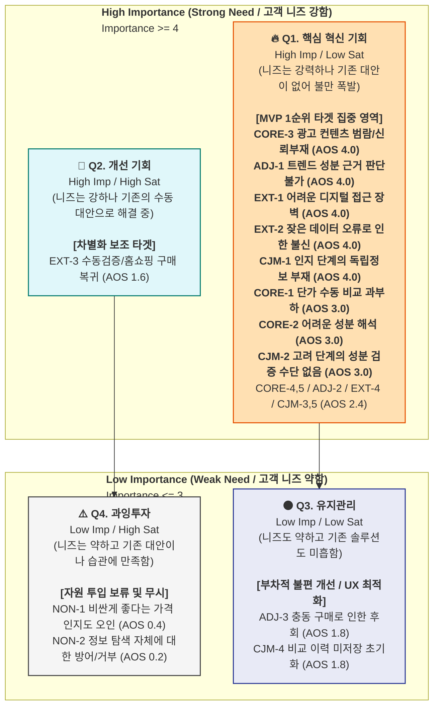
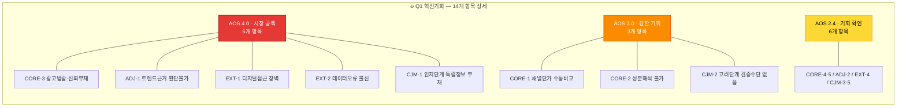

# 4단계: AOS 계산 및 매트릭스 — 건강보조식품 성분·가격 비교 플랫폼

> **방법론:** AOS-DOS 워크플로우 Step ④
> **계산식:** `AOS = Importance × (1 − Satisfaction / 5)`
> **사분면 기준:** Likert 5점 척도 중간값 3.0 기준 (방법론 A 방식)
> **전 단계:** `2.importance-evaluation.md` (Imp) + `3.satisfaction-evaluation.md` (Sat)

---

## A. AOS 계산 결과 — 전체 항목

### 🔵 핵심 (Core)

| # | Pain / Goal | Imp | Sat | 1−Sat/5 | **AOS** |
|---|---|---|---|---|---|
| CORE-3 | 광고성 콘텐츠 범람, 신뢰 정보 부재 | 5 | 1 | 0.80 | **4.00** |
| CORE-1 | 채널 간 단가 비교 수동 작업 과부하 | 5 | 2 | 0.60 | **3.00** |
| CORE-2 | 성분 정보 해석 불가 → 비교 불가 | 5 | 2 | 0.60 | **3.00** |
| CORE-4 | 가격 적정성 판단 기준 부재 | 4 | 2 | 0.60 | **2.40** |
| CORE-5 | 장시간 탐색에도 확신 있는 결론 실패 | 4 | 2 | 0.60 | **2.40** |

### 🟢 확장 (Adjacent)

| # | Pain / Goal | Imp | Sat | 1−Sat/5 | **AOS** |
|---|---|---|---|---|---|
| ADJ-1 | 트렌드 성분 과학적 근거 판단 불가 | 5 | 1 | 0.80 | **4.00** |
| ADJ-2 | 광고/진짜 구분 불가 + 가격 차이 근거 없음 | 4 | 2 | 0.60 | **2.40** |
| ADJ-3 | FOMO 충동 구매 → 후회 반복 | 3 | 2 | 0.60 | **1.80** |

### 🔴 극단 (Extreme)

| # | Pain / Goal | Imp | Sat | 1−Sat/5 | **AOS** |
|---|---|---|---|---|---|
| EXT-1 | 디지털 인터페이스 접근 장벽 | 5 | 1 | 0.80 | **4.00** |
| EXT-2 | 데이터 오류 → 카테고리 전체 불신 | 5 | 1 | 0.80 | **4.00** |
| EXT-4 | 오류·불편의 부정적 확산 | 4 | 2 | 0.60 | **2.40** |
| EXT-3 | 수동 검증/홈쇼핑 의존 복귀 | 4 | 3 | 0.40 | **1.60** |

### ⚫ 비활성 (Non-user)

| # | Pain / Goal | Imp | Sat | 1−Sat/5 | **AOS** |
|---|---|---|---|---|---|
| NON-1 | 저가 제품 미인지 + 가격-품질 오인 | 2 | 4 | 0.20 | **0.40** |
| NON-2 | 정보 방어·거부 + 탐색 니즈 부재 | 1 | 4 | 0.20 | **0.20** |

### CJM 여정 단계별

| # | Pain / Goal | Imp | Sat | 1−Sat/5 | **AOS** |
|---|---|---|---|---|---|
| CJM-1 | [인지] 광고 vs 독립 정보 구분 불가 | 5 | 1 | 0.80 | **4.00** |
| CJM-2 | [고려] 성분 이해 불가 + 검증 없음 | 5 | 2 | 0.60 | **3.00** |
| CJM-5 | [충성도] DB 커버리지 한계 | 4 | 2 | 0.60 | **2.40** |
| CJM-3 | [결정] 마지막 신뢰 확인 수단 없음 | 4 | 2 | 0.60 | **2.40** |
| CJM-4 | [온보딩] 이력 미저장 → 재방문 초기화 | 3 | 2 | 0.60 | **1.80** |

---

## B. AOS 내림차순 종합 순위

| 순위 | Pain ID | Pain 내용 | 분류 | Imp | Sat | **AOS** | 사분면 |
|---|---|---|---|---|---|---|---|
| **1** | CORE-3 | 광고성 콘텐츠 범람, 신뢰 정보 부재 | 🔵 핵심 | 5 | 1 | **4.00** | 🔥 Q1 혁신기회 |
| **1** | ADJ-1 | 트렌드 성분 과학적 근거 판단 불가 | 🟢 확장 | 5 | 1 | **4.00** | 🔥 Q1 혁신기회 |
| **1** | EXT-1 | 디지털 인터페이스 접근 장벽 | 🔴 극단 | 5 | 1 | **4.00** | 🔥 Q1 혁신기회 |
| **1** | EXT-2 | 데이터 오류 → 카테고리 전체 불신 | 🔴 극단 | 5 | 1 | **4.00** | 🔥 Q1 혁신기회 |
| **1** | CJM-1 | [인지] 광고 vs 독립 정보 구분 불가 | CJM | 5 | 1 | **4.00** | 🔥 Q1 혁신기회 |
| **6** | CORE-1 | 채널 간 단가 비교 수동 작업 과부하 | 🔵 핵심 | 5 | 2 | **3.00** | 🔥 Q1 혁신기회 |
| **6** | CORE-2 | 성분 정보 해석 불가 → 비교 불가 | 🔵 핵심 | 5 | 2 | **3.00** | 🔥 Q1 혁신기회 |
| **6** | CJM-2 | [고려] 성분 이해 불가 + 검증 없음 | CJM | 5 | 2 | **3.00** | 🔥 Q1 혁신기회 |
| **9** | CORE-4 | 가격 적정성 판단 기준 부재 | 🔵 핵심 | 4 | 2 | **2.40** | 🔥 Q1 혁신기회 |
| **9** | CORE-5 | 장시간 탐색에도 확신 결론 실패 | 🔵 핵심 | 4 | 2 | **2.40** | 🔥 Q1 혁신기회 |
| **9** | ADJ-2 | 광고/진짜 구분 불가 + 가격 근거 없음 | 🟢 확장 | 4 | 2 | **2.40** | 🔥 Q1 혁신기회 |
| **9** | EXT-4 | 오류·불편의 부정적 확산 | 🔴 극단 | 4 | 2 | **2.40** | 🔥 Q1 혁신기회 |
| **9** | CJM-3 | [결정] 마지막 신뢰 확인 수단 없음 | CJM | 4 | 2 | **2.40** | 🔥 Q1 혁신기회 |
| **9** | CJM-5 | [충성도] DB 커버리지 한계 | CJM | 4 | 2 | **2.40** | 🔥 Q1 혁신기회 |
| **15** | ADJ-3 | FOMO 충동 구매 → 후회 반복 | 🟢 확장 | 3 | 2 | **1.80** | ⚫ Q3 유지관리 |
| **15** | CJM-4 | [온보딩] 이력 미저장 → 재방문 초기화 | CJM | 3 | 2 | **1.80** | ⚫ Q3 유지관리 |
| **17** | EXT-3 | 수동 검증/홈쇼핑 의존 복귀 | 🔴 극단 | 4 | 3 | **1.60** | 💎 Q2 개선기회 |
| **18** | NON-1 | 저가 제품 미인지 + 가격-품질 오인 | ⚫ 비활성 | 2 | 4 | **0.40** | ⚠️ Q4 과잉투자 |
| **19** | NON-2 | 정보 방어·거부 + 탐색 니즈 부재 | ⚫ 비활성 | 1 | 4 | **0.20** | ⚠️ Q4 과잉투자 |

---

## C. AOS 기회 매트릭스 시각화

### AOS 사분면 매트릭스



### 🔥 Q1 혁신기회 상세 — AOS 계층별 분포



### 사분면별 Pain 배치

| 사분면 | 조건 | 항목 수 | 배치된 Pain (AOS 내림차순) |
|---|---|---|---|
| 🔥 **Q1 혁신기회** | High Imp + Low Sat | **14개 (74%)** | **AOS 4.0:** CORE-3, ADJ-1, EXT-1, EXT-2, CJM-1 / **AOS 3.0:** CORE-1, CORE-2, CJM-2 / **AOS 2.4:** CORE-4, CORE-5, ADJ-2, EXT-4, CJM-3, CJM-5 |
| 💎 **Q2 개선기회** | High Imp + Mid Sat | **1개 (5%)** | **AOS 1.6:** EXT-3 |
| ⚫ **Q3 유지관리** | Mid Imp + Low Sat | **2개 (11%)** | **AOS 1.8:** ADJ-3, CJM-4 |
| ⚠️ **Q4 과잉투자** | Low Imp + High Sat | **2개 (11%)** | **AOS 0.2~0.4:** NON-1, NON-2 |

---

## D. 사분면별 전략 해석

| 사분면 | 전략 행동 |
|---|---|
| 🔥 **Q1 혁신기회** | MVP 실험 1순위. JTBD 인터뷰 대상. 핵심·확장·극단 분류의 Pain이 모두 집중 |
| 💎 **Q2 개선기회** | 대체 솔루션이 부분 작동 중(홈쇼핑·수동 검증). 차별화 포인트 확보 필요 |
| ⚫ **Q3 유지관리** | UX 최적화 수준. Phase 2 이후 대응 |
| ⚠️ **Q4 과잉투자** | N1 비활성 영역. 직접 투자 불필요 — 간접 바이럴만 유효 |

### 🔥 Q1 혁신기회 Top 5 — MVP 타게팅 1순위

| 순위 | Pain | AOS | 해결 기능 | 분류 |
|---|---|---|---|---|
| **1** | 광고 범람 + 독립 비교 부재 | 4.00 | "광고 아님" 독립 플랫폼 정체성 + SEO 콘텐츠 | 🔵 핵심 |
| **2** | 트렌드 성분 근거 판단 불가 | 4.00 | 과학적 근거 등급 팩트체크 콘텐츠 | 🟢 확장 |
| **3** | 디지털 인터페이스 접근 장벽 | 4.00 | 3탭 결론 UX + 16px 고대비 + 카카오 공유 | 🔴 극단 |
| **4** | 데이터 오류 → 카테고리 불신 | 4.00 | 출처 투명 공개 + 오류 신고·48h 처리 | 🔴 극단 |
| **5** | 채널 간 단가 수동 비교 과부하 | 3.00 | 환율 실시간 채널 통합 단가 자동 비교 | 🔵 핵심 |

---

## E. AOS 분포 요약

```
전체 19개 항목 AOS 분포
━━━━━━━━━━━━━━━━━━━━━━━━━━━━━━
  4.00: █████   5개 (26%)  ← 최고 혁신기회
  3.00: ███     3개 (16%)  ← 강한 혁신기회
  2.40: ██████  6개 (32%)  ← 혁신기회 하단
  1.80: ██      2개 (11%)  ← 유지관리
  1.60: █       1개 ( 5%)  ← 개선기회
  0.40: █       1개 ( 5%)  ← 과잉투자
  0.20: █       1개 ( 5%)  ← 과잉투자
━━━━━━━━━━━━━━━━━━━━━━━━━━━━━━
  AOS 평균: 2.63 | 중앙값: 2.40
```

**핵심 인사이트:** 19개 항목 중 14개(74%)가 Q1 혁신기회에 집중 → 이 시장은 전반적으로 **Unmet Need가 극도로 높은 블루오션**. 특히 AOS 4.0 = 5개 항목은 대체 솔루션이 사실상 전무한 시장 공백.

---

## 변경 이력

| 날짜 | 버전 | 파일명 | 내용 |
|---|---|---|---|
| 2026-04-02 | v1.0 | `1.persona_pain_goal_summary.md` | Pain/Goal 리스트 정리 (Step ①) |
| 2026-04-02 | v2.0 | `2.importance-evaluation.md` | Importance 평가 (Step ②) |
| 2026-04-02 | v3.0 | `3.satisfaction-evaluation.md` | Satisfaction 평가 (Step ③) |
| 2026-04-02 | **v4.0** | **`4.aos-calculation.md`** | **AOS 계산 + 기회 매트릭스 시각화 (Step ④)** |
