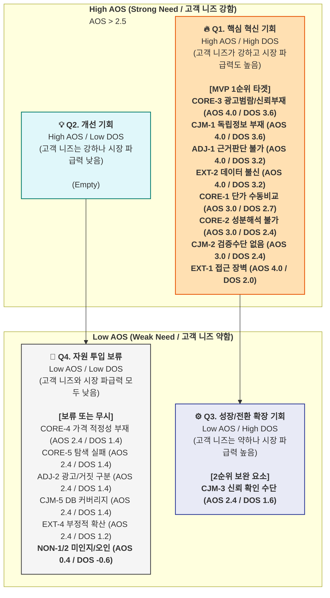

## **A. Market Relevance 평가 기준**

> Market Relevance(0.1~1.0)는 해당 Pain이 **TAM-SAM-SOM에서 갖는 비중**과 **시장 성장률·채택 난이도·확산성**을 종합 평가
> 

| 시장 데이터 | 수치 | 출처 |
| --- | --- | --- |
| TAM (한국 건기식 정보 시장) | 500~1,500억 원 | TAM 보고서 |
| SAM (커머스 연동 모델) | 5~11억 원/년 | SAM 보고서 |
| SOM (1년 차) | 0.5~1.0억 원 | SOM 보고서 |
| Primary: Q1-A (가성비 최적화자) | 100~200만 명 | SOM 수익 엔진 55% |
| Secondary: Q4-A (건강 계기 진입자) | 130~240만 명 | 자발적 유입·성장 엔진 |
| Traffic: Q4-C (트렌드 추종) | 94~135만 명 | SEO 유입 채널 |
| Extreme: E1 (디지털 약자) | 350~430만 명 | 간접 전환만 가능 |
| Non-user: Q3 (브랜드 의존) | 525~800만 명 | 직접 전환 불가 |

---

## **B. DOS 계산 — 전체 항목**

### **🔵 핵심 (Core)**

| # | Pain / Goal | Imp | Sat | MR | MR 근거 | **DOS** |
| --- | --- | --- | --- | --- | --- | --- |
| CORE-3 | 광고 범람, 신뢰 정보 부재 | 5 | 1 | **0.9** | Q1-A+Q4-A 양 타겟 유입의 전제. 독립 플랫폼 차별화 핵심 | **3.60** |
| CORE-1 | 채널 간 단가 비교 수동 과부하 | 5 | 2 | **0.9** | Q1-A Primary, SOM 수익 55%. MVP 핵심 기능 직결 | **2.70** |
| CORE-2 | 성분 해석 불가 → 비교 불가 | 5 | 2 | **0.8** | Q4-A Secondary, Q4→Q1 전환으로 LTV 상승. SEO 유입 핵심 | **2.40** |
| CORE-4 | 가격 적정성 판단 기준 부재 | 4 | 2 | **0.7** | 전환 지원 기능. 핵심이나 독립 수익원은 아님 | **1.40** |
| CORE-5 | 장시간 탐색 → 확신 결론 실패 | 4 | 2 | **0.7** | 리텐션·LTV에 직접 영향. D30 리텐션 15% 목표와 연결 | **1.40** |

### **🟢 확장 (Adjacent)**

| # | Pain / Goal | Imp | Sat | MR | MR 근거 | **DOS** |
| --- | --- | --- | --- | --- | --- | --- |
| ADJ-1 | 트렌드 성분 근거 판단 불가 | 5 | 1 | **0.8** | Q4-C 트래픽 엔진. 글루타치온 검색 340%↑. SEO 최대 유입원 | **3.20** |
| ADJ-2 | 광고/진짜 구분 + 가격 근거 없음 | 4 | 2 | **0.7** | Q4-C 전환 지원. 구매 예측성 낮아 직접 수익 기여 제한적 | **1.40** |
| ADJ-3 | FOMO 충동 구매 → 후회 | 3 | 2 | **0.5** | 간접 Pain. 예방 중심으로 수익 연결 약함 | **0.50** |

### **🔴 극단 (Extreme)**

| # | Pain / Goal | Imp | Sat | MR | MR 근거 | **DOS** |
| --- | --- | --- | --- | --- | --- | --- |
| EXT-2 | 데이터 오류 → 카테고리 불신 | 5 | 1 | **0.8** | C1(수익 엔진) 신뢰의 전제 조건. 데이터 오류 시 파워유저부터 이탈 | **3.20** |
| EXT-1 | 디지털 인터페이스 접근 장벽 | 5 | 1 | **0.5** | 350~430만 명 최대 규모이나 간접 전환만 가능. 접근성 설계가 C2 UX도 개선 | **2.00** |
| EXT-4 | 오류·불편의 부정적 확산 | 4 | 2 | **0.6** | 시스템 리스크. C1 잠재 유입 억제 파급력 | **1.20** |
| EXT-3 | 수동 검증/홈쇼핑 의존 복귀 | 4 | 3 | **0.4** | 대체 솔루션이 작동 중. 긴급도 낮음 | **0.40** |

### **⚫ 비활성 (Non-user)**

| # | Pain / Goal | Imp | Sat | MR | MR 근거 | **DOS** |
| --- | --- | --- | --- | --- | --- | --- |
| NON-1 | 미인지 + 가격-품질 오인 | 2 | 4 | **0.3** | 525~800만 명이나 전환 확률 0. 간접 바이럴 경로만 | **−0.60** |
| NON-2 | 방어·거부 + 탐색 니즈 부재 | 1 | 4 | **0.2** | 직접 투자 대비 효과 없음 | **−0.60** |

### **CJM 여정 단계별**

| # | Pain / Goal | Imp | Sat | MR | MR 근거 | **DOS** |
| --- | --- | --- | --- | --- | --- | --- |
| CJM-1 | [인지] 독립 정보 부재 | 5 | 1 | **0.9** | 퍼널 최상단. 모든 유기적 유입의 출발점. SEO 전략 핵심 | **3.60** |
| CJM-2 | [고려] 성분·검증 수단 없음 | 5 | 2 | **0.8** | 미드퍼널. 여기서 이탈하면 전환 0 | **2.40** |
| CJM-3 | [결정] 신뢰 확인 수단 없음 | 4 | 2 | **0.8** | 바텀퍼널. 커머스 클릭(수익)에 직결 | **1.60** |
| CJM-5 | [충성도] DB 커버리지 한계 | 4 | 2 | **0.7** | 장기 LTV. 파워유저 이탈 시한폭탄 | **1.40** |
| CJM-4 | [온보딩] 이력 미저장 | 3 | 2 | **0.6** | 리텐션 영향이나 치명적이지는 않음 | **0.60** |

---

## **C. DOS 내림차순 종합 순위**

| 순위 | Pain ID | Pain 내용 | 분류 | AOS | **DOS** | Insight |
| --- | --- | --- | --- | --- | --- | --- |
| **1** | CORE-3 | 광고 범람 + 독립 비교 부재 | 🔵 핵심 | 4.00 | **3.60** | 고객 미충족 최고 × 양 타겟 유입 전제 = **최우선 혁신 기회** |
| **1** | CJM-1 | [인지] 독립 정보 부재 | CJM | 4.00 | **3.60** | 퍼널 최상단 공백. SEO 선점이 1년 차 유입의 생존 조건 |
| **3** | ADJ-1 | 트렌드 성분 근거 판단 불가 | 🟢 확장 | 4.00 | **3.20** | 검색 340%↑ 트렌드. 트래픽 확보와 직결되는 고성장 기회 |
| **3** | EXT-2 | 데이터 오류 → 카테고리 불신 | 🔴 극단 | 4.00 | **3.20** | C1 수익 엔진의 신뢰 전제. 데이터 정확도 SLA 필수 |
| **5** | CORE-1 | 채널 단가 수동 비교 과부하 | 🔵 핵심 | 3.00 | **2.70** | SOM 수익 55% 직결. MVP 핵심 기능 1순위 |
| **6** | CORE-2 | 성분 해석 불가 → 비교 불가 | 🔵 핵심 | 3.00 | **2.40** | Q4→Q1 전환 경로의 관문. 일상어 번역으로 해결 |
| **6** | CJM-2 | [고려] 성분·검증 수단 없음 | CJM | 3.00 | **2.40** | 미드퍼널 이탈 방지. 전환율의 핵심 변수 |
| **8** | EXT-1 | 디지털 접근 장벽 | 🔴 극단 | 4.00 | **2.00** | AOS 최고이나 간접 전환만 가능 → DOS가 억제. Phase 2 |
| **9** | CJM-3 | [결정] 신뢰 확인 수단 없음 | CJM | 2.40 | **1.60** | 커머스 클릭 직전 이탈 방지. 독립 평가 배지로 해결 |
| **10** | CORE-4 | 가격 적정성 판단 기준 부재 | 🔵 핵심 | 2.40 | **1.40** | 시장 평균 대비 가격 위치 표시 기능으로 대응 |
| **10** | CORE-5 | 탐색 결론 실패 | 🔵 핵심 | 2.40 | **1.40** | 리텐션 D30 ≥ 15% 달성의 핵심 변수 |
| **10** | ADJ-2 | 광고/진짜 구분 + 가격 근거 | 🟢 확장 | 2.40 | **1.40** | Phase 2 콘텐츠 전략 시 대응 |
| **10** | CJM-5 | [충성도] DB 커버리지 한계 | CJM | 2.40 | **1.40** | DB 1,000개 목표와 연결. 점진적 확장 |
| **14** | EXT-4 | 부정적 확산 | 🔴 극단 | 2.40 | **1.20** | 오류 신고 체계로 리스크 관리 |
| **15** | CJM-4 | [온보딩] 이력 미저장 | CJM | 1.80 | **0.60** | Phase 2 UX 개선 항목 |
| **16** | ADJ-3 | FOMO 충동 구매 → 후회 | 🟢 확장 | 1.80 | **0.50** | Phase 2 이후 콘텐츠로 대응 |
| **17** | EXT-3 | 수동 검증/홈쇼핑 의존 | 🔴 극단 | 1.60 | **0.40** | 대체 솔루션 작동 중. 긴급도 낮음 |
| **18** | NON-1 | 미인지 + 가격-품질 오인 | ⚫ 비활성 | 0.40 | **−0.60** | 직접 투자 불필요. 간접 바이럴만 |
| **18** | NON-2 | 방어·거부 + 탐색 니즈 부재 | ⚫ 비활성 | 0.20 | **−0.60** | 직접 투자 불필요. 간접 바이럴만 |

---

## **D. AOS-DOS 결합 매트릭스**

> **Y축:** AOS (고객 미충족 강도) | **X축:** DOS (시장 기회 강도) **기준선:** AOS 평균 2.5 / DOS 평균 1.5
> 

### **AOS-DOS 사분면별 Pain 배치**

| 사분면 | 조건 | 항목 수 | 배치된 Pain |
| --- | --- | --- | --- |
| 🔥 **Q1 혁신기회** | AOS ≥ 2.5 + DOS ≥ 1.5 | **8개** | CORE-3, CORE-1, CORE-2, ADJ-1, EXT-1, EXT-2, CJM-1, CJM-2 |
| 💡 **Q2 개선기회** | AOS ≥ 2.5 + DOS < 1.5 | **0개** | — |
| ⚙️ **Q3 유지관리** | AOS < 2.5 + DOS ≥ 1.5 | **1개** | CJM-3 |
| 🚫 **Q4 보류** | AOS < 2.5 + DOS < 1.5 | **10개** | CORE-4·5, ADJ-2·3, EXT-3·4, CJM-4·5, NON-1·2 |

### **🔥 Q1 혁신기회 8개 — 최종 타게팅 우선순위**

| 순위 | Pain | AOS | DOS | 전략 | Phase |
| --- | --- | --- | --- | --- | --- |
| **1** | CORE-3 광고 범람 + 독립 비교 부재 | 4.0 | 3.60 | "광고 아님" 독립 플랫폼 정체성 확립 | **MVP** |
| **1** | CJM-1 인지단계 독립 정보 부재 | 4.0 | 3.60 | SEO 콘텐츠 선점 (비타민D 추천 등) | **MVP** |
| **3** | ADJ-1 트렌드 성분 근거 판단 불가 | 4.0 | 3.20 | 과학적 근거 등급 팩트체크 콘텐츠 | **Phase 2** |
| **3** | EXT-2 데이터 오류 → 카테고리 불신 | 4.0 | 3.20 | 데이터 출처 투명 공개 + 오류 신고 체계 | **MVP** |
| **5** | CORE-1 채널 단가 수동 비교 과부하 | 3.0 | 2.70 | 환율 실시간 채널 통합 단가 자동 비교 | **MVP** |
| **6** | CORE-2 성분 해석 불가 | 3.0 | 2.40 | 성분명 일상어 번역 + 증상 기반 필터 | **MVP** |
| **6** | CJM-2 고려단계 검증 수단 없음 | 3.0 | 2.40 | 일상어 번역 + 출처 투명 공개 | **MVP** |
| **8** | EXT-1 디지털 접근 장벽 | 4.0 | 2.00 | 3탭 결론 UX + 카카오 공유 | **Phase 2** |

---

## **E. AOS vs. DOS 비교 — 핵심 발견**

| 발견 | 설명 |
| --- | --- |
| **AOS 최고 ≠ DOS 최고** | EXT-1(디지털 장벽)은 AOS 4.0이지만 DOS 2.0. 고객 니즈는 절박하나 시장 수익 연결이 간접적 → Phase 2로 배치 |
| **DOS가 AOS 순위를 역전하는 항목** | CORE-1(채널 단가 비교)는 AOS 3.0으로 중위권이지만 DOS 2.70으로 상위. SOM 수익 55% 직결이라 시장 가중치가 높음 |
| **DOS 음수 = 투자 불필요 확인** | NON-1·2는 DOS −0.60 → Satisfaction이 Importance를 초과하여 "이미 만족 중"인 영역. 시장 투자 무의미 재확인 |
| **AOS-DOS 양쪽 최고 = CORE-3, CJM-1** | "독립 비교 플랫폼" 정체성과 SEO 유입이 사업 전체의 최우선 과제 |

---

## **F. 최종 MVP 기능 우선순위 — AOS-DOS 결합 근거**