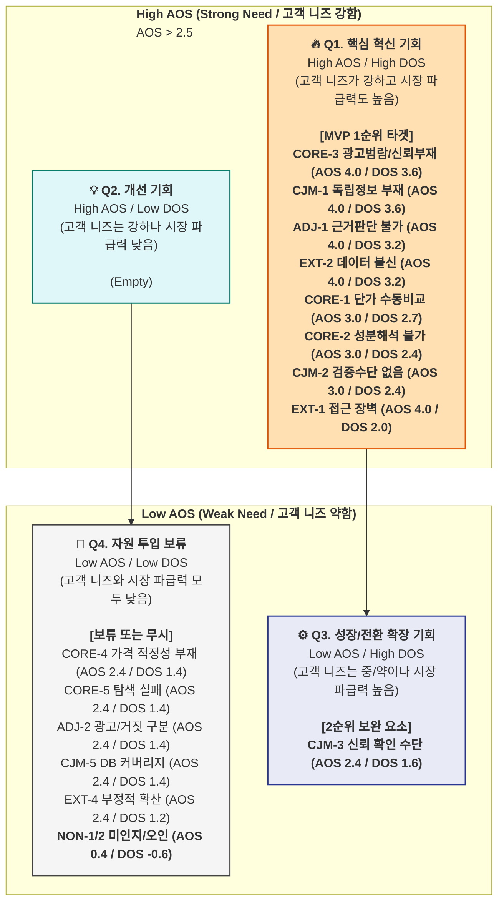

# 5단계: 최종 시장 기회 판단 (AOS+DOS) — 건강보조식품 성분·가격 비교 플랫폼

> AOS는 고객 한 명의 중요도를 반영한 지표라면,
>
> DOS는 **시장 규모와 맥락을 곱해 ‘발견된 기회(Discovered Opportunity Score)’를 산출**
>
> *→ **기회 점수 = 고객 미충족 × 시장 파급력** 으로 계산.*

### 🧠 AOS vs. DOS 비교

| 구분 | AOS | DOS |
| --- | --- | --- |
| 계산기준 | 고객 체감 중심 | 시장가중 중심 |
| 데이터 출처 | 페르소나, CJM | TAM/SAM, 1년 차 SOM 프레임워크 |
| 목적 | 혁신 아이디어 탐색 | 시장 확장성 및 수익성 검증 |
| 적용 시점 | 리서치 초기 | 비즈니스 모델 검증 (MVP 타겟팅) |
| 핵심 활용 | 중요도·만족도 평가 | 시장 규모 가중치(MR)를 적용한 기회 산출 |

### 💡 DOS(Discovered Opportunity Score)의 개념

> “고객의 미충족 × 시장 가치”의 교차점 = **진짜 기회 영역**
>
> ```markdown
> DOS = (Importance - Satisfaction) × Market Relevance
> ```
>
> → **Market Relevance 수치는 시장 파급력**
>   1년 차 SOM 타겟(Q1-A, Q4-A)에 대한 기여도, 트래픽 확산성, 전환 영향력 등을 고려하여 0.1~1.0 사이로 평가.

---

### 1. DOS 산출 근거 (Market Relevance 평가 기준)

DOS를 계산하기 위해 각 Pain/Goal이 전체 시장(TAM/SAM/SOM)에서 차지하는 **전략적 중요성(Market Relevance)**을 수치화했습니다.

- **(높음: 0.8~0.9):** SOM 수익의 55%를 차지하는 Primary 타겟(Q1-A)의 핵심 니즈이거나, 자발적 유입을 이끄는 Secondary 타겟(Q4-A) 및 SEO 유입의 결정적 관문. (예: 광고 범람, 독립 채널 부재, 단가 수동 비교)
- **(중간: 0.6~0.7):** 가격 적정성 확인, DB 커버리지 확보 등 커머스 전환이나 리텐션을 보조하는 기능. 파급력은 높지만 플랫폼 진입 자체의 전제 조건은 아님.
- **(낮음: 0.5 이하):** 비활성(Non-user) 상태이거나, 대체를 이미 찾은 경우(홈쇼핑, 지인 의존), 또는 간접적인 파급력만 가지는 경우.

---

### 2. 🚀 종합 기회 평가표 (AOS vs. DOS)

이 분석은 **"고객이 이 문제를 얼마나 중요하게 생각하는가?(AOS)"**와 **"이 문제를 해결하는 것이 우리 비즈니스 매출/유입에 얼마나 큰 영향을 미치는가?(DOS)"**를 종합적으로 평가합니다.

- **AOS 기준:** 2.5 초과 시 'High' / 2.5 이하 시 'Low'
- **DOS 기준:** 1.5 초과 시 'High' / 1.5 이하 시 'Low'

| **분류 (세그먼트)** | **Pain / Goal** | **Imp** | **Sat** | **AOS** | **Market Rel.** | **DOS** | **Quadrant** | **전략적 해석** |
| --- | --- | --- | --- | --- | --- | --- | --- | --- |
| **Core (Q1+Q2)** | 광고 범람, 신뢰 정보 부재 (CORE-3) | 5 | 1 | **4.0** | 0.9 | **3.6** | **Q1** | **(1순위)** 양대 핵심 타겟(Q1, Q4) 유입의 최우선 전제 조건. |
| **CJM (인지)** | [인지] 독립 정보 부재 (CJM-1) | 5 | 1 | **4.0** | 0.9 | **3.6** | **Q1** | **(1순위)** 모든 유기적 유입(SEO)의 출발점이며 시장 공백. |
| **Adjacent (A2)** | 트렌드 성분 근거 판단 불가 (ADJ-1) | 5 | 1 | **4.0** | 0.8 | **3.2** | **Q1** | **(1순위)** 검색량과 트래픽 확보가 직결되는 고성장 기회 (Phase 2 우선). |
| **Extreme (E2)** | 데이터 오류 → 카테고리 불신 (EXT-2) | 5 | 1 | **4.0** | 0.8 | **3.2** | **Q1** | **(1순위)** 플랫폼 모델 기반을 흔드는 핵심 블로커(이탈 방어). |
| **Core (Q1)** | 채널 간 단가 수동 비교 과부하 (CORE-1) | 5 | 2 | **3.0** | 0.9 | **2.7** | **Q1** | **(1순위)** SOM 수익 모델의 핵심 축. 커머스 전환을 직접 창출. |
| **Core (Q2)** | 성분 해석 불가 → 비교 불가 (CORE-2) | 5 | 2 | **3.0** | 0.8 | **2.4** | **Q1** | **(1순위)** Q4(초보자)를 Q1(전문가)로 온보딩 시키는 핵심 가치. |
| **CJM (고려)** | [고려] 성분·검증 수단 없음 (CJM-2) | 5 | 2 | **3.0** | 0.8 | **2.4** | **Q1** | **(1순위)** 미드퍼널에서 이탈을 막고 거래로 이어주는 필수 기능. |
| **Extreme (E1)** | 디지털 인터페이스 접근 장벽 (EXT-1) | 5 | 1 | **4.0** | 0.5 | **2.0** | **Q1** | **(1순위)** AOS는 최고이나, 직접 해결 시 타겟 확산 제약. 점진적 개선 영역. |
| **CJM (결정)** | [결정] 신뢰 확인 수단 없음 (CJM-3) | 4 | 2 | **2.4** | 0.8 | **1.6** | **Q3** | (2순위) AOS는 조금 낮으나 DOS 파급력이 큼. 바텀퍼널 전환율 영향. |
| **Core (Q1+Q2)** | 가격 적정성 판단 기준 부재 (CORE-4) | 4 | 2 | **2.4** | 0.7 | **1.4** | **Q4** | (보류) 전환 보조 기능이나 즉각적인 매출원 창출은 아님. |
| **Core (Q1+Q2)** | 탐색 결론 실패 (CORE-5) | 4 | 2 | **2.4** | 0.7 | **1.4** | **Q4** | (보류) 장기 리텐션 보조 항목. |
| **Adjacent (A2)** | 광고/진짜 구분 + 가격 근거 (ADJ-2) | 4 | 2 | **2.4** | 0.7 | **1.4** | **Q4** | (보류) Phase 2 콘텐츠 기능. |
| **CJM (충성도)** | [충성도] DB 커버리지 한계 (CJM-5) | 4 | 2 | **2.4** | 0.7 | **1.4** | **Q4** | (보류) DB 점진 확보 과제. |
| **Extreme (E1/E2)** | 부정적 확산 (EXT-4) | 4 | 2 | **2.4** | 0.6 | **1.2** | **Q4** | (보류) 일반적 리스크 관리. |
| **Adjacent (A2)** | FOMO 충동 구매 → 후회 (ADJ-3) | 3 | 2 | **1.8** | 0.5 | **0.5** | **Q4** | (보류) 핵심 구매동인에서 벗어남. |
| **Extreme (E1/E2)** | 수동 검증/홈쇼핑 의존 (EXT-3) | 4 | 3 | **1.6** | 0.4 | **0.4** | **Q4** | (보류) 높은 Satisfaction(대안작동)으로 기회 창출력 미미. |
| **Non-user (N1)** | 미인지 / 가격-품질 오인 (NON-1/NON-2) | 1~2 | 4 | **0.2~0.4** | 0.2~0.3 | **-0.6** | **Q4** | **(무시)** 자원 투입 낭비. |

---

### 3. AOS vs. DOS 기회 포트폴리오 (Mermaid)



---

### 4. 최종 전략 결론: MVP의 우선순위

AOS와 DOS의 교차 분석을 통해 매우 명확한 **시장 진입 로드맵**이 도출됩니다.

#### Phase 1 (MVP 핵심): Q1 "핵심 혁신 기회"에 집중 (AOS & DOS 모두 높음)
Core(핵심), Extreme(극단) 페르소나 및 CJM 최상단 여정이 모두 Q1에 집중되었습니다. 즉, 이 Pain들이 시장 초기 진입(PMF)과 트래픽 확보의 열쇠입니다. MVP는 다음 사항을 최우선 해결해야 합니다.

1. **신뢰 기반 확보 (CORE-3, EXT-2, CJM-1):** 정보의 투명성 부재와 광고 범람을 깨는 **'독립 비교 플랫폼'** 포지셔닝이 필수입니다. "광고 없는 순수 데이터"와 "오류 신고 SLA(48시간 내 처리)" 제공으로 생태계 장벽(Blocker)을 해소해야 합니다.
2. **수익의 원천 설계 (CORE-1):** 1년 차 SOM 목표 달성의 핵심인 가성비 최적화자(Q1-A)를 위해, **실시간 환율 기반 채널(iHerb, 쿠팡 등) 단가 자동 비교 계산기**를 완성해야 합니다.
3. **신규 유입/전환 파이프라인 (CORE-2, CJM-2):** 건기식 입문자(Q4-A)가 성분 장벽에 막히지 않도록, 어려운 기능성 원료명을 쉬운 **일상어 번역(+증상 기반 필터)**으로 지원해 코어 유저로 육성해야 합니다.

#### Phase 2 (확장 보조): Q3 및 일부 Q1 기능 강화 (확장성 확보)
- **콘텐츠 및 트래픽 폭발 (ADJ-1):** 트렌드 성분에 대한 판단 근거를 찾는 확장 페르소나(A2)를 대상으로 '의학/과학 데이터 기반 팩트체크 콘텐츠'를 제공하여 유기적 유입(SEO)을 극대화합니다.
- **바텀퍼널 전환율 제고 (CJM-3):** AOS는 2.4로 경계에 있으나 DOS 시장 파급력이 높은 결제 직전 신뢰 단계. **상대적 비교 인증 배지** 등을 도입해 실질적인 제휴 수수료 창출을 돕습니다.

#### Phase 3 (보류/무시): Q4 "자원 투입 보류" (AOS & DOS 모두 낮음)
- **방어 기제 타겟 (NON-1, NON-2):** 정보 탐색 자체를 거부하거나(AOS 0.2~0.4), 이미 익숙한 홈쇼핑에 만족하는(DOS -0.6) N1(조미라) 타겟을 설득하려는 마케팅 및 기능 투자는 **철저히 배제**해야 합니다. 자녀(Extreme 대리구매)를 통한 간접 바이럴에만 의존합니다.
- **부차적 유지보수:** DB 무한 확장(CJM-5)보다는 핵심 성분 상위 300개의 데이터 퀄리티에 집중하는 게 타당합니다.
