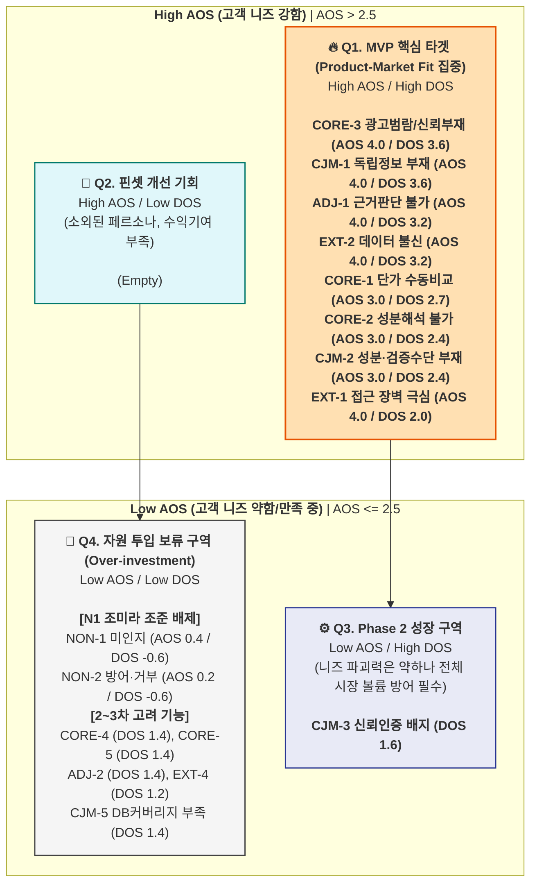

# 페르소나 중심 AOS–DOS 결합 매트릭스 종합 리포트

> **문서 목적:** 페르소나 및 고객 여정지도(CJM) 분석 결과를 토대로 도출된 Pain Point를 중요도(Importance)와 만족도(Satisfaction) 기준으로 수치화(AOS)하고, 해당 세그먼트의 TAM/SOM 비중을 기반으로 시장 가중치(MR)를 적용하여 기회 요인(DOS)을 도출한다. 최종적으로 AOS-DOS Combined Matrix를 시각화하여 MVP 기능 설계의 우선순위를 확립한다.
> **참조 데이터:** `w2-2Persona-CJM` (페르소나 6명 구조 및 CJM), `w2-3.AOS-DOS` (AOS/DOS 원본 수치)

---

## 1. 페르소나별 Pain 수치화 및 AOS (미충족 요구) 산출

**AOS (Asymmetry of Satisfaction) 산출 공식:** `Importance × (1 - Satisfaction / 5)`
*(Imp/Sat 모두 Likert 5점 척도 기준, 중간값 3.0)*

| 그룹 구분 | 페르소나 유형 | Pain ID | 핵심 Pain 내용 | Imp | Sat | AOS | 해석 |
| :--- | :--- | :--- | :--- | :---: | :---: | :---: | :--- |
| **🔵 핵심** | **C1 한정훈** (가성비) | CORE-1 | 채널 간 단가 비교 수동 작업 과부하 | 5 | 2 | **3.00** | 높은 중요도 대비 자동화 대안 부재 |
| | **C2 박소연** (건강계기) | CORE-2 | 성분 정보 해석 불가 → 비교 불가 | 5 | 2 | **3.00** | 성분 리터러시 장벽으로 탐색 중단율 높음 |
| | **C2 박소연** (건강계기) | CORE-3 | 광고성 콘텐츠 범람, 신뢰 정보 부재 | 5 | 1 | **4.00** | 독립 비교 플랫폼 가치의 핵심 |
| | C1/C2 공통 | CORE-4 | 가격 적정성 판단 기준 부재 | 4 | 2 | **2.40** | 결제 전 막연한 찝찝함 유발 |
| | C2 중심 | CORE-5 | 장시간 탐색에도 확신 있는 결론 실패 | 4 | 2 | **2.40** | 탐색을 포기하고 베스트셀러로 타협함 |
| **🟢 확장** | **A2 정수빈** (트렌드) | ADJ-1 | 트렌드 성분 과학적 근거 판단 불가 | 5 | 1 | **4.00** | 바이럴을 지탱할 팩트체크 부재 |
| | **A2 정수빈** (트렌드) | ADJ-2 | 광고/진짜 구분 불가 + 가격 차이 근거 | 4 | 2 | **2.40** | 8배 가격 차이에 대한 납득 원함 |
| | **A2 정수빈** (트렌드) | ADJ-3 | FOMO 충동 구매 → 후회 반복 | 3 | 2 | **1.80** | 예방적 정보이나 긴급도 다소 낮음 |
| **🔴 극단** | **E1 나경아** (디지털약자)| EXT-1 | 디지털 인터페이스 접근 장벽 | 5 | 1 | **4.00** | 자발적 진입 불가, 카카오톡 의존 |
| | **E2 김도현** (신뢰실패) | EXT-2 | 데이터 오류 → 카테고리 전체 불신 | 5 | 1 | **4.00** | 수익엔진 C1 이탈과 직결됨 |
| | **E1 나경아** (디지털약자)| EXT-3 | 수동 검증/홈쇼핑 의존 복귀 | 4 | 3 | **1.60** | 기존 오프라인 방식에 만족도가 있음 |
| | **E2 김도현** (신뢰실패) | EXT-4 | 오류·불편의 부정적 확산 | 4 | 2 | **2.40** | 플랫폼 평판 리스크 |
| **⚫ 비활성**| **N1 조미라** (브랜드맹신)| NON-1 | 저가 제품 미인지 + 가격-품질 오인 | 2 | 4 | **0.40** | 현 방식에 고만족, 전환 매우 낮음 |
| | **N1 조미라** (브랜드맹신)| NON-2 | 정보 방어·거부 + 탐색 니즈 부재 | 1 | 4 | **0.20** | 무탐색자 대상으로 유입 투자 불필요 |
| **CJM 공통**| 전 여정 | CJM-1 | [인지] 광고 vs 독립 정보 구분 불가 | 5 | 1 | **4.00** | SEO 최초 진입 시 신뢰 확보 |
| | 전 여정 | CJM-2 | [고려] 성분 이해 불가 + 검증 없음 | 5 | 2 | **3.00** | 일상어 번역 필수 요구됨 |
| | 전 여정 | CJM-3 | [결정] 마지막 신뢰 확인 수단 없음 | 4 | 2 | **2.40** | 독립 평가/오류 신고 배지로 해결 |
| | 전 여정 | CJM-4 | [온보딩] 이력 미저장 → 재방문 초기화 | 3 | 2 | **1.80** | 리텐션 저해하나 초기에는 치명적 아님|
| | 전 여정 | CJM-5 | [충성도] DB 커버리지 한계 | 4 | 2 | **2.40** | 장기 사용 시 파워유저 이탈 유발 |

---

## 2. TAM 규모 비중 추정 및 DOS (시장 기회) 산출

**DOS (Degree of Strategic Opportunity) 산출 공식:** `AOS × Market Relevance (MR)`
*MR은 해당 페르소나가 타겟 시장 모수(SOM 1년차 수치), 수익 기여도, 트래픽 유발성에 미치는 가중치(0.1 ~ 0.9)*

| 세그먼트 | 예상 모수 규모 추정 | 전략적 시장 비중 기여도 |
| :--- | :--- | :--- |
| **Q1-A (C1)** | 100만 ~ 150만 명 | **시장수익 엔진(55%)**. MVP 직결, 가장 높은 전환율 |
| **Q4-A (C2)** | 130만 ~ 240만 명 | **시장성장 엔진**. Q1 전환을 위한 자발적 탐색가 |
| **Q4-C (A2)** | 94만 ~ 135만 명 | **트래픽 확보**. SEO 유입 주축(글루타치온 등) |
| **Q4-극단 (E1)**| 350만 ~ 430만 명 | 모수규모 최대이나 직접 플랫폼 인지/채택 난이도 극상 |
| **Q3 (N1)** | 525만 ~ 800만 명 | 시장의 40% 이상 차지. 하지만 전환율 0 (방어성향) |

*(AOS 핵심 8개 Pain 기준에 DOS 점수 적용)*

| 순위 | Pain ID | 페르소나 분류 | AOS | MR 가중치 | 대상 세그먼트 시장성 종합 평가 | DOS |
|---:|:---|:---|:---:|:---:|:---|---:|
| **1** | **CORE-3** | 🔵 핵심 (C2, C1) | 4.00 | **0.9** | Q1-A + Q4-A 100% 포괄. 전환의 첫 번째 조건 | **3.60** |
| **1** | **CJM-1** | 전 여정 (SEO 인지) | 4.00 | **0.9** | 신규 트래픽의 모든 유입 채널 대응 | **3.60** |
| **3** | **ADJ-1** | 🟢 확장 (A2) | 4.00 | **0.8** | Q4-C 트래픽 규모(트렌드 검색량 폭증) 방어 | **3.20** |
| **3** | **EXT-2** | 🔴 극단 (E2, C1) | 4.00 | **0.8** | C1(수익엔진)의 리텐션을 유지하기 위한 SLA | **3.20** |
| **5** | **CORE-1** | 🔵 핵심 (C1) | 3.00 | **0.9** | MVP 수수료 모델(SAM/SOM)의 55% 수익 직결 | **2.70** |
| **6** | **CORE-2** | 🔵 핵심 (C2) | 3.00 | **0.8** | Q4-A 탐색의 최초 허들. 여기서 통과 못하면 전환 0% | **2.40** |
| **6** | **CJM-2** | 전 여정 (고려 단계) | 3.00 | **0.8** | 미드퍼널 비교 도구 부재 해소 | **2.40** |
| **8** | **EXT-1** | 🔴 극단 (E1) | 4.00 | **0.5** | 모수는 400만 이상이나 직접 결제 확률 매우 낮아 MR 저감 | **2.00** |

---

## 3. AOS-DOS Combined Matrix 시각화

> **해석 기준:** X축(DOS)은 시장의 실질적 파급력 수치화. Y축(AOS)은 유저 개인이 느끼는 결핍의 강도. 두 점수가 모두 2.5(AOS) / 1.5(DOS)를 넘기는 `Q1 혁신 기회 영역`이 MVP의 필수 요구사항.

---

## 4. AOS-DOS 매트릭스가 페르소나 활용에 주는 시사점

1. **N1 조미라 타겟 배제의 데이터적 승인:** 비활성 페르소나 N1의 경우 모수는 500~800만 명(가장 큰 시장 체적)임에도 불구하고 Satisfaction이 과도하게 높아 AOS가 0.4이하를 머무릅니다. 이는 DOS 값 `-0.60`으로 귀결되어, 이 층을 플랫폼 유입 기법으로 끌어들이려는 노력은 완벽히 과잉 투자임을 시사합니다. C2, A2의 '간접적인 공유 구전'으로만 노출해야 합니다.
2. **C1 한정훈 기능의 최상위 중요성 입증:** 한정훈의 `CORE-1(단가 비교 자동화)`는 AOS 점수상 타 문제(AOS 4.0)에 밀려 AOS 3.0에 등재되었으나, 페르소나 C1의 제휴 마케팅 시장 수익 기여분(MR 0.9)을 곱할 시 DOS 2.70으로 상위권 핵심 MVP 필수 기능에 랭크되었습니다. 
3. **E2 김도현 SLA 가이드라인의 MVP 위상:** `EXT-2(데이터 불신)`의 해결(출처 공개 및 접수)은 통상 백엔드 유지보수 기능으로 간주되나, AOS 4.0, DOS 3.2를 동시에 달성하여 전방위적 UX 기획 단계에서부터 우선 도입해야 하는 핵심 요구사항 반열에 올랐습니다. 데이터 무결성이 마케팅/전환을 모두 보장하는 가장 튼튼한 무기임이 증명된 것입니다. 

## 5. 최종 결론: MVP 1순위 집중 기능 세트 (Q1 스팟)

이 매트릭스 결과에 따라 가장 강력한 파괴력을 지닌 MVP 주요 기능을 4가지로 한정합니다.

1. **독립 선언과 에비던스 기반 정보 제공 (AOS 4.0 / DOS 3.6)**
   - "광고 없음, 객관적 측절"을 강조하는 첫 화면 UI 설계.
   - 트렌드 성분에 대한 팩트체크 리포트 (SNS 공유 기능 연동)
2. **다중 채널 실시간 환율 기반 단가 자동 계산기 (AOS 3.0 / DOS 2.7)**
   - Iherb, 쿠팡, 네이버 등 다채널 환율, 사이즈, 용량별 1알당 실제 단가 계산 자동화
3. **전문 용어 한 줄 번역 및 증상별 필터 엔진 (AOS 3.0 / DOS 2.4)**
   - 모르는 성분도 직관적으로 번역. (ex: 콜레칼시페롤 → 몸에 잘 흡수되는 비타민 D3)
4. **오류 실시간 제보 및 데이터 출처 투명 표기 (AOS 4.0 / DOS 3.2)**
   - 모든 제품 정보 하단에 [식약처 원본 라벨 소스 확인], [오류 신고하기] 필수 탑재 
