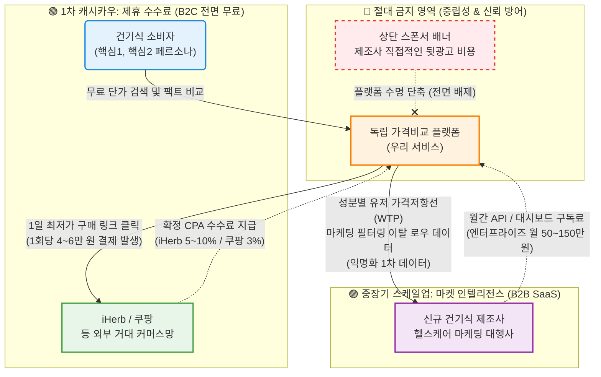

# 건강보조식품 비교 플랫폼 수익화 구조 시각화 (Revenue Flow Map)

> **문서분류:** 신사업 비즈니스 모델(BM) 전략
> **작성 목적:** 투자자 및 내부 팀원들이 우리 플랫폼의 **'독립성(광고 배제)'** 원칙이 어떻게 강력하고 지속가능한 듀얼 수익 파이프라인(Dual Revenue Pipeline)으로 작동하는지 직관적으로 이해할 수 있도록 구조화함.

---

## 💎 Dual Pipeline Business Model Architecture

우리 플랫폼은 사용자 지갑을 직접 열거나, 건강기능식품 브랜드에게 직접 배너 광고비를 받는 행위를 **'플랫폼 장기 생존의 적'**으로 간주하며, 대신 다음 두 가지 데이터 중심의 트랙으로 수익을 극대화합니다.

### 💡 파이프라인별 기대 효과 요약
1.  **제휴 수수료 파이프라인 (CPA):** B2C 유저의 비용 부담은 '0원'이지만 구매 시마다 수익이 발생. 특히, 건기식의 **높은 재구매 빈도(3~6개월)**로 인해 사용자 리텐션이 곧 **반복 매출(Recurring Revenue)**로 직결됨.
2.  **데이터 구독 파이프라인 (SaaS):** B2C를 통해 오염되지 않은 순수한 '성분별 소비자 심리 가격선' 데이터를 축적. 이를 분석하기 위해 막대한 리서치 비용을 쓰는 제조사에 직접 판매하여 **최대 90% 이상의 SaaS 마진율** 확보.
