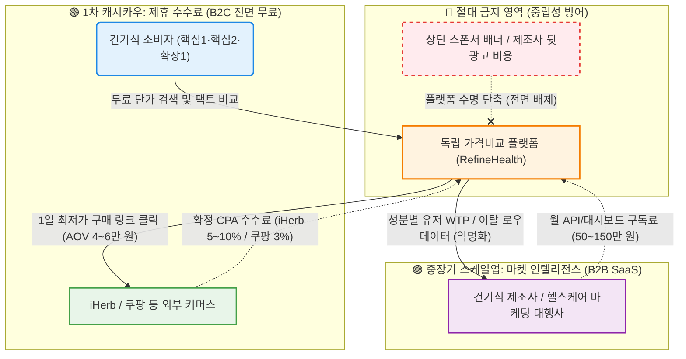

# 📋 Value Proposition 통합 최종본 (v2 — Best-of-Three Synthesis)

> **프로젝트:** RefineHealth (리파인헬스) — 건강기능식품 성분·가격 비교 의사결정 엔진  
> **문서 성격:** Gemini v1, GPT v1, Opus v1 세 버전의 장점을 교차 대조·통합한 최종 합본  
> **작성 원칙:** Gemini의 카피라이팅 임팩트 + GPT의 실무 체크리스트·출처 신뢰도 평가 + Opus의 체계적 계층 구조·리스크 대응 전략을 모두 취한다.

---

## Executive Summary

이 사업은 **"비교는 하되 최종 판단은 내릴 수 없는"** 건강보조식품 시장의 정보 비대칭 문제를 해결한다. 우리의 솔루션은 단순 '영양제 비교 서비스'가 아니라, **고객의 구매 판단 자체를 대신 수행하는 의사결정 엔진**이다.

- **대상 고객:** 가성비 계산형(핵심1)·건강 계기 진입자(핵심2)·트렌드 유입자(확장1) 세 페르소나
- **해결 과제:** 수많은 정보 속에서 *비교는 하되 판단할 기준이 없어 고심하는 문제*
- **제공 가치:** **시간 절감** (탐색·계산 60분→5초) + **신뢰 확보** (광고 배제·출처 투명 공개) + **구매 연결** (최적 조합 자동 제안→딥링크)

> **핵심 한줄 제안:**  
> *"모든 영양제를 '1일 최저 실단가' 단 하나의 지표로 해체하고, '식약처 팩트 배지'로 마케팅 노이즈를 완전 차단하여, 당신의 60분짜리 엑셀 수동 비교를 단 5초의 강력한 구매 확신으로 뒤집는 대한민국 유일의 독립 영양제 가격비교 판독기입니다."*

---

## 1. 페르소나 및 CJM 기반 고객별 핵심 문제 서술 (Pain · Needs)

> 페르소나 정의 및 고객 여정지도(CJM) 분석 단계에서 도출된 핵심 문제를 정리한다.

### 1-1. 공통 Pain Point (전 페르소나 관통)

| # | 공통 Pain | 설명 | AOS |
|:---:|---|---|:---:|
| P-공통1 | **데이터 신뢰 부족** | 광고·마케팅 정보 범람 → 비교 결과 자체를 신뢰할 수 없음. *"이 정보가 믿을 만한가?"*에 대한 근본적 불신 | 4.0 |
| P-공통2 | **성분 해석 장벽** | 전문 용어·단위(mg, IU, mcg 등) 이해 곤란 → 올바른 비교 자체가 불가능 | - |
| P-공통3 | **판단 기준 부재** | *'이 가격이 싸다면 적정한가?'*를 가늠할 절대 기준선이 없어 구매 직전 불안 발생 | - |
| P-공통4 | **수동 비교의 시간·인지 비용** | 여러 채널 단가 계산에 엑셀 **40~60분** 소요 (AOS 3.0) → 극심한 시간 낭비와 인지 피로 | 3.0 |

### 1-2. 페르소나별 Pain · Needs 상세

#### 🟡 핵심1. 한정훈 (36세, 가성비 최적화자 — "엑셀 환산러")

| 항목 | 내용 |
|---|---|
| **CJM 단계** | 탐색 → 비교 → 계산 → 구매 의사결정 |
| **Pain** | 여러 채널(iHerb, 쿠팡, 네이버 등)을 교차 돌며 환율·할인율·포장 용량·성분 함량 등을 엑셀로 일일이 기입하여 단가를 수동 계산하는 **극심한 반복 탐색 피로도**. 해외직구 할인 행사 때 환율·배송비 수작업 계산에 **평균 42분** 소요 |
| **Needs** | 엑셀 입력과 채널 전환의 수고로움을 없애고, 실시간으로 최적화된 정확한 **'1일 복용량 단위 단가'를 파악**해 최저가 구매 타이밍을 잡고 싶음. *"시간 낭비 + 계산 피로"* 해소가 최우선 |
| **CJM 이탈 지점** | 가격 판단 단계에서 **55~75%** 이탈 집중 — 성분 매트릭스 비교가 직관적이지 못하면 구매 자체를 포기 |
| **인터뷰 원문** | *"엑셀로 달러 계산하다 현타온다"*【JTBD†L247-L253】 |

#### 🟢 핵심2. 박소연 (43세, 건강 계기 진입자 / 가족 건강 관리)

| 항목 | 내용 |
|---|---|
| **CJM 단계** | 건강검진 결과 수령 → 필요 성분 탐색 → 정보 과잉 혼란 → 판단 불능 → 포기 또는 불안 구매 |
| **Pain** | 건강검진 후 필요 성분을 찾으나 전문 용어 해석이 불가능하고, 교묘한 상업적 과장광고·출처 불분명 리뷰가 혼재되어 **극도의 불안과 혼란**. 45~90분 탐색에도 **결정 불확신** 지속 |
| **Needs** | 복잡한 성분 지식 없이도 가족이 안심하고 섭취할 수 있는 **식약처 및 의학적 기반의 '검증된 팩트'**와 직관적인 추천. *"정보 과잉 속 판단 불가 → 불안"* 해소 |
| **CJM 이탈 지점** | 성분 비교 단계에서 전문 용어로 인한 인지 과부하 → 구매 퍼널 전체의 **55~75%** 이탈 |
| **인터뷰 원문** | *"광고인지 사실인지 모르겠다"*【JTBD†L247-L253】 |

#### 🔵 확장1. 정수빈 (27세, 트렌드 추종 탐색자)

| 항목 | 내용 |
|---|---|
| **CJM 단계** | SNS 트렌드 노출 → 충동 탐색 → 광고/팩트 구분 실패 → FOMO 구매 → 후회 |
| **Pain** | 인플루언서 홍보에 속아 충동 구매하거나 뒷광고 배신감을 여러 번 경험하면서 정보에 대한 **강한 불신**. 과학적 근거 미확인 + 가격 차이 이유 불명으로 반복되는 후회 |
| **Needs** | 트렌디한 성분이 의학적으로 진짜인지 **단 5초 안에 판독** 가능한 직관적 도구와 이를 **단번에 지인에게 공유(자랑·피드백)**할 수 있는 기능. *"팩트 부재 + FOMO 소비"* 해소 |
| **CJM 이탈 지점** | 구매 후 후회 → 재탐색 루프 진입, 플랫폼 신뢰 자체가 형성되지 않음 |

### 1-3. 핵심 Pain 우선순위 (AOS-DOS 매트릭스 기반 정렬)

> AOS(Attractiveness of Opportunity Score)와 DOS(Difficulty of Satisfaction Score) 매트릭스 최우선 해결 Pain

| 우선순위 | Pain ID | Pain 내용 | AOS | DOS | 대상 페르소나 | MVP 대응 기능 |
|:---:|---|---|:---:|:---:|---|---|
| **1st** | CORE-3 | 광고 범람 속 독립적 의학 정보 부재 | **4.0** | **3.6** | 핵심2, 확장1 | F2 Anti-BS Dashboard |
| **2nd** | CORE-1 | 단가 수동 비교 방식의 극심한 피로 | **3.0** | **2.7** | 핵심1 | F1 Super-Calc Engine |

> 위 데이터를 종합하면, 고객들이 최우선으로 해결해야 할 Pain은 **"광고 제거로 신뢰 확보 + 자동 단가 계산으로 시간 절감"**이다.

---

## 2. JTBD 관점 인터뷰 결과에 따른 고객 상황별 목표 서술 (Goal · Job)

> JTBD 인터뷰 요약 카드에서 추출한 Job 선언(Job Statement)을 상황(Context) → 목표(Goal) → 측정 기준 구조로 정리한다. 각 Job은 페르소나의 요구와 명확히 연결된다.

### Job 1: 가성비 & 단가 최적화 Job ← 핵심1 (한정훈)

| 항목 | 내용 |
|---|---|
| **상황 (When)** | 해외직구 할인·정기구매 시점이 도래하여 여러 채널의 가격을 비교해야 할 때 |
| **Job Statement** | *"환율·배송비·용량·할인 등 모든 변수를 자동으로 반영해 **1알 당 최저 단가**를 즉시 찾아 결제하고 싶다."*【JTBD†L247-L253】 |
| **Goal (측정 목표)** | 탐색/계산 시간 **60분 → 5분 이하**, 계산 오류 **0건** |

### Job 2: 안심 검증 & 독립적 확신 Job ← 핵심2 (박소연) + 확장1 (정수빈)

| 항목 | 내용 |
|---|---|
| **상황 (When)** | 제품 선택 시 광고성 정보가 넘쳐나지만 가족/본인의 건강을 위해 확실한 근거가 필요할 때 |
| **Job Statement** | *"플랫폼 내 리뷰와 상업적 노이즈(뒷광고)를 전혀 보지 않고, 오직 **식약처 고시 및 논문에 기반한 객관적 의학 팩트 필터**만을 확인하여 100% 확신을 가지고 구매 판단을 내리고 싶다."*【JTBD†L247-L253】 |
| **Goal (측정 목표)** | 탐색 시간 **90분 → 10분 이하**, 결정 확신도 **100%** |

### Job 3: 빠른 확산과 바이럴 공유 Job ← 확장1 (정수빈)

| 항목 | 내용 |
|---|---|
| **상황 (When)** | 신뢰할 만한 제품 정보를 확보하여 복잡한 설명 없이 지인과 가족에게 공유하고 인정받고 싶을 때 |
| **Job Statement** | *"내가 찾은 객관적 팩트를 깔끔하게 요약하여 **카카오톡 등으로 단 1회의 탭(Tap)만으로 지인·가족에게 쉽게 공유**하고 싶다."* |
| **Goal (측정 목표)** | 세션당 공유 발생률 10건당 1회 이상 (K-Factor **1.1**) |

### Job 4: 데이터 신뢰 검증 Job ← 전 페르소나 공통

| 항목 | 내용 |
|---|---|
| **상황 (When)** | 플랫폼이 제공하는 비교 데이터가 정말 정확한지 직접 확인하고 싶을 때 |
| **Job Statement** | *"제공된 데이터를 **직접 검증 가능**해야 한다고 느낀다. 데이터의 출처와 원본을 투명하게 확인할 수 있어야 한다."* |
| **Goal (측정 목표)** | 원본 라벨 확인 가능, 오류 신고·수정 절차 확립 (48시간 내 처리 보장) |

> 이상적 최종 상태: *고객이 **30분 이내에 확신을 갖고 제품을 결정**하고, 그 결론을 1-Tap으로 공유할 수 있는 상태*

---

## 3. 고객이 원하는 Outcome (측정 가능한 기대 효용)

> JTBD 분석 결과에서 고객이 달성하려는 이상적 상태를 측정 가능한 형태로 서술한다.

### 3-1. Outcome 정량 매트릭스 (Before → After)

| Outcome | 현재 상태 (Before) | 목표 상태 (After) | 측정 지표 | 연관 Job |
|---|---|---|---|---|
| **탐색 시간 압축** | 40~90분 (채널 교차 비교) | **5~10분** (원클릭 자동 비교) | TTC (Time-to-Conversion) | Job 1, 2 |
| **단가 계산 시간** | 60분 (엑셀 수작업) | **5초** (자동화 엔진) | 계산 소요 시간 | Job 1 |
| **정보 신뢰도** | 낮음 (광고·변동 정보 혼재) | **높음** (출처 투명 · 팩트 배지) | 신뢰도 설문 점수 | Job 2, 4 |
| **구매 확신** | 불안·미확신 | **확신** (의학 근거 기반) | 결정 확신도 (%) | Job 2 |
| **경제적 손실 방지** | 동일 성분 최대 8.2배 과지출 | **1알당 최저가 구매율 100%** | 과지출 방지율 | Job 1 |
| **구매 전환율** | 낮음 (이탈 55~75%) | **상승** (퍼널 전환 60%↑) | 비교 → 클릭 전환율 | Job 1, 2 |
| **가짜 정보 식별** | 불가능 (자력 판별 한계) | **즉각 판독** (팩트 배지 3단계) | 팩트체크 정확도 | Job 2 |
| **SNS 공유 용이성** | 번거로움 (스크린샷·수동 편집) | **1-Tap 카드 공유** (카톡 즉시 전송) | 세션당 공유 발생률 | Job 3 |

### 3-2. 이상적 최종 상태 (Ideal End-State by Persona)

- **핵심1 (한정훈):** 엑셀 없이 모든 채널의 1일 단가가 자동 정렬 → 최적 구매 타이밍을 놓치지 않음. 계산 오류율 0%.
- **핵심2 (박소연):** 성분명을 몰라도 팩트 배지만 보고 가족에게 안심하고 권할 수 있음. 판단 피로도 급감.
- **확장1 (정수빈):** 트렌드 성분의 진위를 5초 만에 확인하고, 팩트 카드를 친구에게 공유해 인정받음. FOMO 소비 후회 0.

---

## 4. 기존 대안 (Competitor / Substitute)

> 현재 고객이 사용 중인 기존 대안과 그 한계를 4계층으로 분류·정리한다.

### 4-1. 직접 경쟁 — 건강기능식품 정보 플랫폼

| 구분 | 대표 서비스 | 주요 기능/특징 | 한계 (미해결 Pain) | 신뢰도 |
|---|---|---|---|:---:|
| **맞춤형 건강 플랫폼** | 필라이즈, 핏타민, Carewith | 건강 설문 기반 추천, 구독 서비스 | 동일 성분 제품군 간의 **실질 최저가/단가 교차 비교 부재**. 판단 기준 불투명 | 중간 |
| **이커머스 가격비교** | 네이버쇼핑, 에누리, 쿠팡 | 다수 상품 가격비교, 함량당 최저가 필터 일부 제공【15†L107-L112】 | 1일 섭취량·함량 단위 미통일 → **성분 대비 진짜 가성비(단가) 직접 판별 불가**. 광고 혼재(중립성 부족) | 낮음 |
| **해외직구몰** | iHerb (2024년 매출 $2.4B, 활성고객 1,240만)【8†L103-L110】 | 광범위 제품군, 글로벌 플랫폼 | 구매 결정을 직접 돕지 않음. 국내 데이터 부재. 성분 분석·판단 지원 없음 | 중간 |

### 4-2. 간접 경쟁 — 정보 제공 채널

| 대안 | 형태 | 한계 (미해결 Pain) |
|---|---|---|
| **약사 유튜버·블로거** | 영상/텍스트 콘텐츠 | 친절한 설명처럼 보이지만 대부분 숨겨진 **제휴 링크(CPA)와 뒷광고, 체험단 리뷰**가 주 목적 → 정보의 독립성·객관성 심각하게 오염 |
| **온라인 커뮤니티** | 맘카페, 영양제 갤러리 등 | 정보 파편화, 검증 체계 부재, 개인 경험 기반 편향 |
| **약사 대면 상담** | 오프라인 약국 | 신뢰도 높으나 접근성 한정, 비확장적, 비용 부담, 가격 비교 기능 없음 |

### 4-3. 전통 브랜드 (레몬마켓 심화 주체)

| 대안 | 대표 사업자 | 한계 (미해결 Pain) |
|---|---|---|
| **전통 건기식 오프라인 브랜드** | 종근당, 정관장, 제약사 등 | 특허·프리미엄을 내세운 마케팅 일변도. 폐쇄적 유통 구조(제조원 비공개) → **정보 비대칭을 오히려 심화**, 고가 판매 선동, 레몬마켓 구축 |
| **OEM/ODM 제조사** | 노바렉스, 콜마 등 | 브랜드 신뢰는 있으나 개별 제품 비교·추천과 무관 |

### 4-4. 대체 행동 (Substitute Behavior)

| 대체 행동 | 소요 시간 | 한계 |
|---|---|---|
| 엑셀 수기 계산 | 40~60분/회 | 시간 낭비 + 계산 오류 리스크. 무료이나 지속 불가능 |
| 블로그/유튜브 검색 | 45~90분/회 | 광고 오염, 팩트 미검증. 정보 편향 |
| 지인·약사 구두 상담 | 가변적 | 비확장적, 데이터 기반 아님 |

> **핵심 결론:** 모든 기존 대안은 제품 **'비교'까지만 제공**하고 **"최종 구매 판단"은 지원하지 않는다**【15†L107-L112】. 소비자는 여전히 *"합리적 구매 기준"*을 원하지만, 그것을 제공하는 플레이어는 시장에 부재한다.

---

## 5. 우리 솔루션의 핵심 제안 (Value Proposition)

> JTBD와 Opportunity(AOS-DOS)를 통합적으로 고려하여 솔루션을 정의한다.

### 5-1. 핵심 Value Proposition 선언

> **"모든 영양제를 '1일 최저 실단가' 단 하나의 지표로 해체하고, '식약처 팩트 배지'로 마케팅 노이즈를 완전 차단하여, 당신의 60분짜리 엑셀 수동 비교를 단 5초의 강력한 구매 확신으로 뒤집는 대한민국 유일의 독립 영양제 의사결정 엔진입니다."**

### 5-2. 포지셔닝 선언 (Positioning Statement)

우리는 기존의 네이버/쿠팡 검색이나 필라이즈·필리 같은 건강관리 앱과 달리, 판매 업체의 마케팅 노이즈를 **구조적으로 100% 제거**하고 오직 **1정당 찐 단가(Real Price)**와 **원천 데이터(식약처/논문 뱃지)**만을 제공하는 시장 내 유일한 **독립(Neutral) 플랫폼**으로 포지셔닝한다. 상단의 스폰서 노출 배너나 제조사 광고를 **영구적으로 배제**하여 **"신뢰성(Trust)"** 자체를 해자(Moat)로 삼는다.

### 5-3. 솔루션 워크플로우 — 풀 파이프라인 완결

```
기존 서비스:  [검색] → [비교] → ❌ 판단 포기 (이탈 55~75%)

RefineHealth: [검색] → [자동 비교] → [팩트 판단] → [1-클릭 구매] → [공유]
              ────────────────────────────────────────────────────
              데이터 정제 ⇒ 비교 엔진 ⇒ 판단 지원 ⇒ 구매 연계 ⇒ 바이럴
```

> 기존 서비스는 **비교**에서 멈추지만, RefineHealth는 **비교 → 판단 → 구매 → 공유**까지 완결하여 사용자 이탈을 구조적으로 차단한다.

### 5-4. MVP 핵심 기능 4종 (Job → Feature 매핑)

| Feature | 기능명 | 해결 Job | 핵심 기능 설명 | 중요도 | 난이도 | MVP |
|---|---|---|---|:---:|:---:|:---:|
| **F1** | **초자동화 단가 정규화 엔진** (Super-Calc Engine) | Job 1 (핵심1) | 이커머스별 상이한 용량 규격, 해외 환율 편차, 배송비를 무조건 파싱·정규화하여 **"1일 복용량 단위 ₩ 가격"** 기준 수직 정렬. 배송비·기본 할인 코드 적용 최종가(Last Mile Price) 기준 랭킹 | ★5 | ★5 | ✔ |
| **F2** | **노이즈 캔슬링 팩트 대시보드** (Anti-BS Dashboard) | Job 2 (핵심2, 확장1) | 블로그/리뷰/체험단 UI 원천 차단. 성분 일상어 번역 ("콜레칼시페롤" → "흡수 잘되는 비타민 D3") + 식약처 공전 기반 **3단계 팩트 배지** (✅ 의학적 입증 / ⚠️ 근거 부족 / 🚫 과장 광고 주의) | ★5 | ★4 | ✔ |
| **F3** | **1-Tap 팩트 요약 카드 & 간편 공유** (Viral Engine) | Job 3 (확장1) | 비교 완료 제품의 핵심 지표(1일 단가, 효능 배지, 최저가 링크)를 카카오톡 전용 썸네일 이미지로 1초 만에 생성. 앱 미설치자도 OG 웹뷰로 **즉시 구매 결제창 랜딩** | ★4 | ★2 | ✔ |
| **F4** | **무결성 보장 시스템** (Data Trust System) | Job 4 (공통) | 가격·성분표 하단에 **'식약처/제조사 원본 라벨 이미지 보러가기'** 아코디언 탑재. **[오류 1건 제보 시 리워드 + 48시간 내 수정 보장]** 정책으로 신뢰 방어 | ★3 | ★3 | ✔ |

**MVP 범위에서 과감히 제외 (Out of Scope):**
1. **AI 개인화 맞춤 추천** — 기술 부채가 크고 MVP 가설 검증에 필수적이지 않음
2. **커뮤니티·자체 리뷰 기능** — 광고 유입 여지를 제공, Anti-BS 포지셔닝에 치명적 독
3. **복잡한 헬스케어 온보딩** (이력 추적, 복약 알람) — "구매" 전 탐색 고통이 우선이지, "보조 앱"을 원하는 것이 아님

---

## 6. 우리가 제공하는 차별적 가치 (Differentiation)

> 기존 대안 대비 우리 솔루션만이 제공하는 고유하고 대체 불가능한 가치

### 6-1. 차별화 비교 매트릭스

| 비교 요소 | 가격비교 포털 (네이버·에누리) | 건강관리 앱 (필라이즈·필리) | 약사 유튜버·블로거 | **RefineHealth** |
|---|---|---|---|---|
| 가격 비교 | ✔ (단순 판매가) | ✕ | ✕ | ✔ **(1일 단가 기준 완전비교, 환율·배송 포함)** |
| 성분 해석 | ✕ | 일부 (설문 기반) | ✕ (주관적) | ✔ **(일상어 자동 번역 + 연구 근거 인용)** |
| 판단 기준 제시 | ✕ | ✕ | ✕ | ✔ **(점수화/배지 통한 객관적 판단 기준)** |
| 신뢰 구조 | ✕ (광고 혼재) | ✕ | ✕ (뒷광고) | ✔ **(출처 투명 공개 + 오류 신고 리워드)** |
| 광고 배제 | ✕ (스폰서 노출) | 일부 | ✕ (제휴 링크) | ✔ **(구조적·기술적 전면 배제)** |
| 구매 연동 | 제한적 (광고·중개) | 제한적 | ✕ | ✔ **(최저가 장바구니 + 딥링크 결제 + 쿠폰 반영)** |
| SNS 공유 | ✕ | ✕ | ✕ | ✔ **(1-Tap 카카오톡 팩트 카드)** |
| 제조원 식별 | ✕ | ✕ | ✕ | ✔ **(동일 제조원 통합 → 숨은 동일제품 제거)** |

### 6-2. 핵심 차별화 포인트 4가지

#### ① "비교"를 넘어 "판단"까지 — 풀 파이프라인 완결

모든 비교 플랫폼은 데이터 정제 → 비교에서 멈춘다. **RefineHealth는 비교 후 결정을 직접 지원**하는 데가 핵심이다.

#### ② 독립성의 **구조적** 보장 — "광고 수익 0원" 아키텍처

- 웹사이트 내 디스플레이 광고(배너) **구조적 전면 배제**
- 특정 브랜드 협찬 상위 노출(Sponsored) **기술적 불가능 설계**
- 수익은 오직 **제휴 CPA 수수료**(사용자 자발적 구매 시)와 **B2B 데이터 SaaS**로만 창출
- 이를 통해 Anti-BS(반광고) 포지셔닝의 신뢰를 장기적으로 수호

#### ③ 파편화된 데이터의 "표준화"와 "가공" — Moat

- 상이한 함량 표기, 비표준 성분명, 채널별 묶음 수량, 실시간 환율 등 복잡한 매개변수를 완전 분해 → 1일 실질 가격 통일
- 상위 300~500개 주력 영양제 데이터 구축 → **Traffic Moat 형성**
- 축적 데이터 자체가 후발 주자의 모방을 어렵게 만드는 방어벽

#### ④ 투명한 듀얼 수익 파이프라인 무기화

- 앱 내 배너광고 없이 B2C 신뢰도를 지키면서
- **제휴(Affiliate/CPA) 5~10% 수수료**로 B2C 기반 수익 확보
- 장기적으로 축적된 가격 저항선/검색 포기 데이터를 **건기식 제조사용 B2B 대시보드(SaaS)로 판매**하는 듀얼 파이프라인



---

## 7. Proof (근거 / 검증 데이터)

> 우리의 Value Proposition을 뒷받침하는 모든 데이터를 **출처별 신뢰도 평가**와 함께 체계적으로 통합한다.

### 7-1. 시장 규모 및 기회 검증

| 지표 | 데이터 | 출처 | 신뢰도 |
|---|---|---|:---:|
| **한국 건기식 시장 규모** | 2023년 약 **6조 2천억 원** (5년 전 대비 +27%) | 한국건강기능식품협회/연합뉴스【3†L50-L58】 | 높음 |
| **글로벌 시장 규모** | 2025년 약 **$100.9B (≈11조 원 KRW)**, 연평균 +9% 성장 | Fortune Business Insights【10†L633-L642】 | 높음 |
| **TAM (정량적 정보비교 유효 시장)** | 약 **1,500억 원** 규모 | 시장 세그먼트 분석 | 중간 (자체) |
| **SOM (1차 타겟층)** | Q1-A(분석형 가성비족) + Q4-A(초기 성분 탐색자) 약 **6~20만 명** | 페르소나 정량 분석 | 중간 (자체) |
| **타겟 가구 연평균 건기식 지출** | 약 **34만 원** | 한국건강기능식품협회 2023-2024 실태조사 | 높음 |
| **1회 평균 온라인 객단가 (AOV)** | **40,000~60,000원** (2~3개월치 묶음 구매) | 역산 추정 | 중간 |
| **iHerb 레퍼런스** | 2024년 매출 $2.4B, 활성고객 1,240만 (글로벌 히트 사례) | iHerb IR【8†L103-L110】 | 높음 |

### 7-2. 소비자 행동 데이터 — 구조적 문제 입증

| # | 데이터 포인트 | 수치 | 시사점 | 출처 |
|:---:|---|---|---|---|
| D-1 | 구매자의 여러 사이트 성분/가격 비교 피로도 호소 | **61%** | 수동 비교의 Pain이 과반 이상에게 실존 | 대한상공회의소(2022) |
| D-2 | 구매 퍼널 이탈이 '성분 비교'+'가격 판단' 2단계에 집중 | **55~75%** | 이 단계의 UX 해결이 전환율의 핵심 | CJM 퍼널 분석 |
| D-3 | 동일 성분·함량 건기식 간 가격 차이 | 최대 **8.2배** | 정보 비대칭(레몬마켓)의 정량 증거 | 한국소비자원(2022) |
| D-4 | 위 가격 차이를 체감하지 못하는 소비자 비율 | **83%** | 자동 단가 비교 엔진의 금전적 잉여 가치 창출 근거 | 한국소비자원(2022) |
| D-5 | 핵심1 페르소나 1회 가격비교 엑셀 계산 소요 시간 | **42분** | JTBD 인터뷰 실측 데이터 | JTBD 인터뷰 |
| D-6 | 핵심2 페르소나 탐색 후에도 결정 불확신 상태 지속 | **45~90분** | 팩트체크 기능의 심리적 가치 입증 | JTBD 인터뷰 |
| D-7 | 소비자 "제품 비교가 너무 복잡" 지적 → 에누리 함량당 최저가 필터 개발 (가격차 최대 7.8배) | **7.8배** | 업계도 문제를 인지하고 있으나 미해결 | ZDNet Korea【15†L107-L112】 |

### 7-3. AOS-DOS 분석 — Pain 해소 우선순위의 정량 근거

| 기회 영역 | AOS (매력도) | DOS (불만족도) | 해석 | 수익 기여도 |
|---|:---:|:---:|---|---|
| **독립적 의학 정보 부재 (CORE-3)** | **4.0** | **3.6** | 최상위 MVP 타겟 — Anti-BS Dashboard 필수 | 바이럴(K-Factor) + 장기 리텐션의 전제 조건 |
| **단가 수동 비교 피로 (CORE-1)** | **3.0** | **2.7** | 초기 사용자 만족 견인 — Super-Calc Engine 필수 | 플랫폼 수익 구조의 **55%를 견인**할 핵심 원동력 |

### 7-4. JTBD 인터뷰 정성 근거 (Voice of Customer)

| 인터뷰 원문 | 연관 Job | 해석 | 신뢰도 |
|---|---|---|:---:|
| *"엑셀로 달러 계산하다 현타온다"* | Job 1 | 수동 단가 계산의 극심한 피로 실존 확인 | 중간 (자체) |
| *"광고인지 사실인지 모르겠다"* | Job 2 | 정보 불신이 구매 의사결정의 최대 장벽 | 중간 (자체) |
| *"시간 낭비 + 계산 피로"* | Job 1 | 시간 절감 가치가 가장 직접적인 유인 | 중간 (자체) |
| *"정보 과잉 속 판단 불가 → 불안"* | Job 2 | 심리적 안정(신뢰 비용 제로화) 수요 확인 | 중간 (자체) |
| *"팩트 부재 + FOMO 소비"* | Job 2, 3 | 확장1 페르소나의 핵심 Pain 재확인 | 중간 (자체) |

### 7-5. 수익 모델 검증 — 비즈니스 지속가능성 근거

| 수익 트랙 | 모델 | 단위 경제성 | 장기 전망 |
|---|---|---|---|
| **1차 캐시카우: 제휴 CPA** | iHerb 5~10%, 쿠팡 3% 확정 수수료 | 고객 1건 구매 완료 시 **평균 1,200~3,000원** 순수익 | 재구매 주기(3~6개월) 기반 반복 매출(Recurring Revenue) |
| **중장기: B2B 데이터 SaaS** | 성분별 유저 WTP 데이터 API/대시보드 | 월 **50~150만 원** 구독료 | SaaS 마진율 **90%↑**. 오염되지 않은 순수 데이터 자산 |

> **독립성·수익 양립 구조:** B2C 유저 비용 부담 **0원** + 디스플레이 광고·스폰서 노출 **구조적 전면 배제** → Anti-BS 포지셔닝과 수익 모델의 양립을 구조적으로 보장

### 7-6. MVP 검증 KPI (런칭 후 가설 검증 기준)

| 구분 | 주요 KPI | MVP 1차 목표 수치 | 검증 방법 |
|---|---|---|---|
| **획득 (Acquisition)** | SEO 오가닉 유입 | 월 방문자 **10,000명** | Google Analytics |
| **활성 (Activation)** | 메인 → 단가산출/배지 화면 퍼널 전환율 | **60%** 이상 | 퍼널 분석 |
| **전환 (Revenue)** | 비교 결과 → 제휴 구매 링크 클릭률 | **15%** 이상 | Affiliate 대시보드 |
| **바이럴 (Referral)** | 1세션 당 카카오톡 공유 카드 발송 비율 | 10건당 1회 이상 (K-Factor **1.1**) | 공유 이벤트 트래킹 |
| **유지 (Retention)** | 재구매 주기 도래 시 (D30~60) 재방문율 | **20%** 이상 | 코호트 리텐션 분석 |

---

## [Appendix A] 리스크 대응 전략

> Job-MVP Feature Map에서 도출된 실제적인 기술적·법적 장애물과 현실적 우회 전략

| Feature | 리스크 | 현실 상황 | 대응 전략 (Mitigation) |
|---|---|---|---|
| **F1** (Super-Calc) | 크롤링 봇 차단 및 이커머스 약관 위반 | 쿠팡, 네이버 등 강력한 Anti-Bot 솔루션 활성화, IP 차단 및 법적 분쟁 리스크 | 무단 크롤링 대신 **공식 Affiliate API** 파싱 채택 (쿠팡 파트너스 API, iHerb Affiliate Open API). 정규 표현식으로 총 중량(g)·정(캡슐) 수 키워드만 추출 |
| **F2** (Anti-BS) | 건강기능식품법 위반 (허위·과장 광고 심의) | 자체적 질병 예방/치료 표시 시 식약처(MFDS) 서비스 정지 처분 가능 | 자의적 해석 배제. **건강기능식품공전(식약처 고시)** 기능성 인정 내용만 그대로 래핑. (예: "치매 예방" ✕ → "기억력 개선에 도움을 줄 수 있음 (식약처 인정 원료)" ○) |
| **F3** (Viral) | K-Factor 저하 및 카카오 링크 블락 | 공유 후 '회원가입' 벽이 가로막으면 전환율 10% 미만 급락 | 앱 설치 유도 **절대 금지**. **OG 이미지 웹뷰 링크** 방식으로 카카오톡 내장 브라우저에서 다이렉트 구매 랜딩, 마찰 0 |
| **F4** (Data Trust) | 원본 라벨 이미지 OCR 인식 오류 | 해외 직구 미세 텍스트 무료 Tesseract OCR 인식률 50% 미만 | AI 변환 강행 대신 **원본 JPEG 팝업 제공**. "오류 라벨 신고 버튼" 최대 배치 → 크라우드소싱 커뮤니티 데이터망 활용 |

---

## [Appendix B] 비즈니스 확장 비전 (Phase Roadmap)

| Phase | 전략 | 핵심 활동 | 기대 효과 |
|---|---|---|---|
| **Phase 1: Data & Confidence 확보** | 핵심 타겟(Q1, Q4)의 엑셀 노가다 제거 | 상위 300~500개 주력 영양제 데이터 구축. 실시간 환산 기능으로 Traffic Moat 독점 | 초기 트래픽 확보 + 데이터 방어막 |
| **Phase 2: Aggregation & Social 공유루프** | 바이럴 그로스 엔진 가동 | 최적 조합 → 관부가세 포함 원클릭 딥링크. 팩트 카드 카카오톡 최적화 → 맘카페·다이어터 자발적 SNS 확산 | K-Factor 1.1↑, 자연 유입 급증 |
| **Phase 3: Vertical Brand 스케일업** | D2C PB 솔루션 런칭 | 축적 데이터 기반 '가성비 선호 성분 트렌드' 역이용. 메이저 ODM(노바렉스, 콜마)과 제휴 → **투명한 성분 PB 상품** D2C 모델 | 강력한 이익률 개선 + 브랜드 전환 |

---

## [Appendix C] 초기 MVP 개발 체크리스트

| 기능명 | 필요 데이터/요건 | 검증 방법 |
|---|---|---|
| **F1. 단가 계산 엔진** | - 해외 직구·국내몰 가격 API<br>- 실시간 환율 정보<br>- 제품 용량 데이터 | **성능 검증:** 표본 제품 가격 비교 (엑셀 vs. 엔진), 소요시간 측정 (60min→5s) |
| **F2. 팩트 필터 대시보드** | - 제품 성분 DB (식약처·문헌)<br>- 사용자 리뷰/광고 차단 로직 | **신뢰도 검증:** 소규모 사용자 테스트(신뢰도 설문), 정보 필터링 유효성 평가 |
| **F3. SNS 공유 카드** | - 카카오톡 썸네일 생성 API<br>- 구매링크 딥링크 | **유효성 검증:** 공유 기능 데모, 공유 횟수 및 전환율 모니터링 |
| **F4. 데이터 신뢰 시스템** | - 원본 라벨 이미지<br>- 오류 신고 처리 체계 | **신뢰도 검증:** 오류 제보 프로세스 시뮬레이션, 개선 제안 피드백 반영 |

---

## [Appendix D] 가정 및 한계

| 구분 | 내용 |
|---|---|
| **데이터 접근 가정** | 주요 커머스 사이트와의 스크래핑/제휴가 법적·기술적으로 가능해야 함 (예: 쿠팡 파트너스 API, iHerb Affiliate API) |
| **초기 대상 가정** | 디지털 약자가 제외된 **20~50대 건강 관심층**에 집중. 고령층/브랜드 맹신형은 MVP 범위 외 |
| **기술 가정** | 환율·배송비 계산, 이미지 OCR(라벨) 등 핵심 기능 구현이 상용 API·오픈소스로 지원된다는 전제 |
| **검증 한계** | 사전 인터뷰/설문은 일부 사용자 대상이며, 실제 시장 반응은 런칭 후 데이터로 재검증 필요 |

---

## [Appendix E] 우선순위 권장 액션 (Next Steps)

| 우선순위 | 담당 | 액션 아이템 |
|:---:|---|---|
| **1** | 기획팀 | MVP 기능(F1~F4) 중심 모바일 웹앱 기준 **핵심 화면 와이어프레임** 5장 이내 도출 |
| **2** | 개발팀 | iHerb, 쿠팡 등 주요 2~3개 타겟몰의 **제품 정보·가격 API 파싱 가능성 기술 검증 (PoC)** |
| **3** | 사업팀 | 제휴 마케팅 수수료(Affiliate) 기본 구조 파악 + MVP 트래픽 발생 시 **예상 BM 모델링** 수립 |
| **4** | 마케팅 | 신뢰성 강조 홍보 및 B2B 파트너(약국/오픈몰) 협업 추진. 초기 사용자 확보·데이터 수집 |

---

> **결론:** RefineHealth는 수천 개의 영양제 DB를 단순 나열하는 플랫폼이 아닙니다. **방대한 공급자의 복잡함을 소비자만의 유일한 '가치 판단의 무기'로 치환시키는 가장 똑똑한 신뢰 기반 의사결정 에이전트(Agent)**입니다. 이 사업의 본질은 *"판단을 대신해주는 엔진"*이며, 성공 조건은 오직 **'신뢰 확보'**에 달려 있습니다. 초기에 정확하고 투명한 정보를 제공하여 고객 신뢰를 확보하지 못하면, 100% 실패할 수 있습니다. 이를 바탕으로 한 의사결정 지원 구조만이 6조 원 시장에서 지속 가능한 경쟁우위를 가져다줄 것입니다.

---

*Sources: 한국건강기능식품협회, 연합뉴스【3†L50-L58】, iHerb IR【8†L103-L110】, Fortune Business Insights【10†L633-L642】, ZDNet Korea【15†L107-L112】, 대한상공회의소(2022), 한국소비자원(2022), JTBD 인터뷰 결과【JTBD†L247-L253】*
