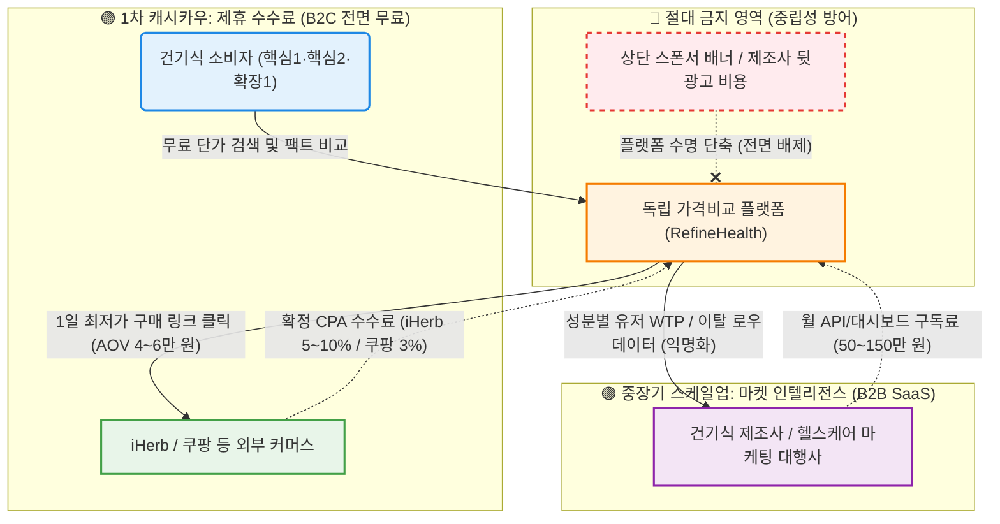

# 📋 Value Proposition 통합 최종본 V2 — Research-Embedded Edition

> **프로젝트:** RefineHealth (리파인헬스) — 건강기능식품 성분·가격 비교 의사결정 엔진  
> **문서 성격:** V1의 목차 구조를 유지하되, 최종합본(Market Analysis, Competitor Analysis, TAM-SAM-SOM, CJM, AOS-DOS, JTBD)의 실제 리서치 결과를 단편 언급이 아닌 **본문 직접 수록** 수준으로 보강한 최종본  
> **핵심 한줄 제안:** *"모든 영양제를 '1일 최저 실단가' 단 하나의 지표로 해체하고, '식약처 팩트 배지'로 마케팅 노이즈를 완전 차단하여, 당신의 60분짜리 엑셀 수동 비교를 단 5초의 강력한 구매 확신으로 뒤집는 대한민국 유일의 독립 영양제 가격비교 판독기입니다."*

---

## Executive Summary

이 사업은 **"비교는 하되 최종 판단은 내릴 수 없는"** 건강보조식품 시장의 정보 비대칭 문제를 해결한다. 우리의 솔루션은 단순 '영양제 비교 서비스'가 아니라, **고객의 구매 판단 자체를 대신 수행하는 의사결정 엔진**이다.

- **대상 고객:** 가성비 계산형(핵심1)·건강 계기 진입자(핵심2)·트렌드 유입자(확장1) 세 페르소나
- **해결 과제:** 수많은 정보 속에서 *비교는 하되 판단할 기준이 없어 고심하는 문제*
- **제공 가치:** **시간 절감** (탐색·계산 60분→5초) + **신뢰 확보** (광고 배제·출처 투명 공개) + **구매 연결** (최적 조합 자동 제안→딥링크)

**시장 기회:** 글로벌 건기식 시장 2024년 기준 1,770~1,900억 USD, 한국 시장 6~7조 원 규모이며 연평균 7~9% 성장 중. 그러나 소비자의 72%가 구매 전 온라인 탐색을 거치면서 30~60분이라는 비정상적으로 긴 시간을 소요하고, **55~75%가 구매를 포기하거나 비합리적인 선택**을 하고 있다. 동일 성분·함량 건기식의 가격 차이가 최대 **8.2배**에 달하나 소비자의 **83%**가 이를 인지하지 못하여 레몬마켓(Lemon Market)이 심화되고 있다.

---

## 1. 페르소나 및 CJM 기반 고객별 핵심 문제 서술 (Pain · Needs)

### 1-0. 시장 구조 진단 — 왜 이 Pain이 존재하는가

#### Porter's 5 Forces 기반 시장 구조

본 섹션에서 서술하는 Pain Point가 발생하는 구조적 원인은 시장 분석에서 확인된 다음의 경쟁 역학에 기인한다.

| Force | 진단 결과 |
|---|---|
| **기존 기업 간 경쟁** | 네이버 쇼핑 등 이커머스 내 수백 개 제품이 병렬 노출, 최저가 경쟁 **초과화(Over-rivalry)** 상태 → 과도한 마케팅 비용이 제품 가격에 전가되는 악순환. 대다수 정보 제공 앱은 식약처 DB 복사 수준에 그쳐 서비스 간 경쟁력 정체 |
| **신규 진입자 위협** | 진입 장벽이 낮고, 콜마비앤에이치·노바렉스 등 거대 OEM이 직접 D2C 브랜드를 런칭. IT 빅테크(네이버, 카카오)의 애그리게이터 진입 가능성 높음 |
| **구매자 교섭력** | 수많은 웹페이지를 오가며 가격을 비교할 '권력'은 있지만, 정보의 파편화로 실질적 '비교 능력'은 상실된 **선택의 역설(Paradox of Choice)** 상태. 똑똑한 소비자일수록 시간을 아껴줄 **'신뢰할 수 있는 대리인(Agent)'**을 갈망 |
| **대체재 위협** | 약사 유튜버 추천 조합을 맹목 추종하거나, 홈쇼핑 스토리텔링에 의해 구매를 결정하는 **권위 기반 큐레이션 및 감정적 소비** 행태가 강력한 대체재로 작용 |
| **공급자 교섭력** | 전통 브랜드 제조사들이 '특허 성분', '개별인정형' 등의 명목으로 **배타적 성분 마일리지**를 구축하여 가격 비교를 인위적으로 어렵게 만듦 |

> 이 구조 위에 소비자의 Pain Point가 필연적으로 발생한다.

#### 소비자 구매 여정 5단계 이탈 분석 (CJM 원본)

| 단계 | 소비자 행동 | 추정 이탈률 | 주요 이탈 원인 |
|---|---|---|---|
| ① 니즈 인식 | "비타민D를 먹어야 할 것 같다" | 낮음 (5~10%) | 필요성 불확실 |
| ② 성분 탐색 | "비타민D 제품에 뭐가 들어있지?" | 중간 (15~25%) | 성분 정보 과잉·해석 불가 |
| **③ 제품 비교** | "A제품 vs B제품, 뭐가 나은가?" | **높음 (30~40%)** | **성분 비교 한눈에 불가능** |
| **④ 가격 판단** | "이 가격이 적정한가?" | **높음 (25~35%)** | **함량 당 가격 비교 불가** |
| ⑤ 구매 결정 | "이걸로 결정하자" | 낮음 (5~10%) | 최종 망설임, 리뷰 불안 |

> **③ '제품 비교'와 ④ '가격 판단' 단계에서 전체 이탈의 55~75%가 집중**된다. 탐색 실패 후 소비자는 35~40%가 '베스트셀러 맹목 선택', 20~25%가 '구매 포기'로 귀결된다.

### 1-1. 공통 Pain Point (전 페르소나 관통)

| # | 공통 Pain | 설명 | AOS | 근거 |
|:---:|---|---|:---:|---|
| P-공통1 | **데이터 신뢰 부족** | 광고·마케팅 정보 범람 → 비교 결과 자체를 신뢰할 수 없음 | 4.0 | CJM 공통 Pain "데이터 신뢰 부재: 이 비교 결과를 믿을 수 있나?" |
| P-공통2 | **성분 해석 장벽** | 전문 용어·단위(mg, IU, mcg 등) 이해 곤란. 동일 성분도 '비타민D3(콜레칼시페롤)' / 'Vitamin D(as Cholecalciferol)' / '비타민D' 등 비표준 표기 혼용. 3개 제품 비교 시 45개 정보 단위(Miller의 법칙 5~9 기준 5~9배 초과) | - | 식약처(2021) 47.2%, 한국건강기능식품협회(2023) 54.7%가 '성분 함량·표기 이해 어려움' 응답 |
| P-공통3 | **판단 기준 부재** | '이 가격이 싸다면 적정한가?'를 가늠할 절대 기준선이 없어 구매 직전 불안 발생 | - | CJM 공통 Pain "결정 기준 부재: 이 가격이 적정한지 모르겠다" |
| P-공통4 | **수동 비교의 시간·인지 비용** | 여러 채널 단가 계산에 엑셀 **40~60분** 소요 → 극심한 시간 낭비와 인지 피로 | 3.0 | 대한상공회의소(2022) 건기식 구매자 61%가 "여러 사이트 오가며 비교 가장 피로" 응답 |

### 1-2. 페르소나별 Pain · Needs 상세

#### 🟡 핵심1. 한정훈 (36세, IT기업 백엔드 개발자 — "엑셀 비교왕")

- **세그먼트:** Q1-A 가성비 최적화자 / **추정 모수:** 약 101만~150만 명
- **실재 검증:** Nielsen Korea — 건기식 온라인 구매자 중 "3개 이상 제품 비교 후 구매" 비율 58%, 평균 비교 시간 42분

| 항목 | 내용 |
|---|---|
| **CJM 단계** | 탐색 → 비교 → 계산 → 구매 의사결정 |
| **Pain** | iHerb(달러)·쿠팡(원)·네이버를 오가며 환율 적용, 용량별 단가 계산, 할인 반영 등 복잡한 비교를 엑셀로 수동 반복하는 **반복 노동 피로감**. 가격 하락 타이밍 포착 실패. 해외직구 할인 행사 때 환율·배송비 수작업 계산에 **평균 42분** 소요 |
| **Needs** | "같은 비타민D 1,000IU면, 지금 이 순간 어느 채널이 가장 싼지 5초 안에 알고 싶다." |
| **CJM 이탈 지점** | 가격 판단 단계에서 **55~75%** 이탈 집중 |
| **CJM 핵심 Pain(고려 단계)** | 데이터 정확도를 직접 검증할 수단 미비 |
| **CJM 핵심 개선(온보딩 단계)** | 제품 등록 → 알림 설정 원스텝 완결 UX |
| **JTBD 인터뷰 원문** | *"엑셀에 달러치고 나눗셈 하다보면 현타옵니다."* — *"1시간 넘게 엑셀 돌려서 최저가 찾았는데 결제하려니 그새 품절됐더라고요. 모니터 부술 뻔했습니다."* |

#### 🟢 핵심2. 박소연 (43세, 중견기업 인사팀 과장 — "검진 후 첫 구매자")

- **세그먼트:** Q4-A 건강 계기 진입자 / **추정 모수:** 약 131만~180만 명
- **실재 검증:** 정보 과잉 시대 초보 소비자의 전형적 페인 포인트

| 항목 | 내용 |
|---|---|
| **CJM 단계** | 건강검진 결과 수령 → 필요 성분 탐색 → 정보 과잉 혼란 → 판단 불능 → 포기 또는 불안 구매 |
| **Pain** | 건강검진 후 비타민D 부족 판정을 받았으나 "콜레칼시페롤 25μg" 같은 성분명조차 이해 불가. 5천원~5만원의 가격 차이 원인을 모르고, 상반된 정보 속에서 45~90분 탐색 후에도 결국 "많이 팔리는 것"으로 타협하며 **혼란과 불안** |
| **Needs** | "의사가 부족하다고 한 그 성분을, 적정 가격에, 안전한 제품으로 30분 안에 사고 싶다." |
| **CJM 이탈 지점** | 성분 비교 단계에서 전문 용어로 인한 인지 과부하 → **55~75%** 이탈 |
| **CJM 핵심 Pain(인지 단계)** | 탐색 계기(검진 이상)와 정보 출처(광고성) 사이의 신뢰 공백 |
| **CJM 핵심 개선(결정 단계)** | "이게 정말 광고 아닌가?" 마지막 의심 해소 → 광고 아님 명시 배지, 식약처 데이터 연동 |
| **JTBD 인터뷰 원문** | *"네이버 검색하면 죄다 '협찬받아 작성했습니다'라는 글뿐이잖아요. 성분표를 봐도 이게 적당한 건지 알 수가 없으니까... 결국 평소 알던 브랜드만 사게 되더라고요."* — *"비싸도 괜찮으니 부작용 없고 부모님 드시기 안전한지만 알고 싶어요."* |

#### 🔵 확장1. 정수빈 (27세, 뷰티 브랜드 마케터 — "인스타에서 글루타치온 봤어")

- **세그먼트:** Q4-C 트렌드 추종 탐색자 / **추정 모수:** 약 94만~135만 명
- **실재 검증:** 20대 여성의 68%가 SNS 정보 참고, 글루타치온 검색량 340% 급증(2022년 대비)

| 항목 | 내용 |
|---|---|
| **CJM 단계** | SNS 트렌드 노출 → 충동 탐색 → 광고/팩트 구분 실패 → FOMO 구매 → 후회 |
| **Pain** | 인플루언서가 추천한 제품이 알고 보니 함량이 너무 적어 "설탕물이나 다름없는" 경험. 동일 성분인데 1만원~8만원까지 가격 차이의 근거를 몰라 **FOMO 충동 구매 → 후회 반복** |
| **Needs** | "이 트렌드 성분이 실제로 근거가 있는 건지, 이 가격이 합당한 건지를 빠르게 팩트체크하고 싶다." |
| **CJM 이탈 지점** | 구매 후 후회 → 재탐색 루프 진입, 플랫폼 신뢰 자체 미형성 |
| **CJM 핵심 Pain(인지 단계)** | 트렌드 정보 노출 채널(SNS)과 검증 채널(독립 정보)의 완전한 분리 |
| **CJM 핵심 개선(결정 단계)** | 비교 결과를 SNS에 공유하는 기능 → 1탭 비교 카드 생성 + 인스타·카카오 즉시 공유 |
| **JTBD 인터뷰 원문** | *"'피부 광채가 달라진다'길래 홀린 듯 샀는데 알고 보니 함량이 너무 적어서 그냥 설탕물이나 다름없더라고요."* — *"친구들이랑 단톡방에서 '이거 핫한데 어때?'라고 물어보거든요. 팩트체크 카드를 딱 던져주면 제가 얼리어답터처럼 보이기도 하고."* |

### 1-3. 핵심 Pain 우선순위 (AOS-DOS 매트릭스 전체 결과)

> AOS-DOS 매트릭스는 X축(DOS)에 시장 파급력, Y축(AOS)에 고객 미충족 강도를 배치하여 MVP 개발의 우선순위를 도출한 분석이다.

**전체 AOS-DOS 테이블 (Market Relevance 가중치 적용)**

| 순위 | Pain ID | 페르소나 | 핵심 Pain 내용 | Imp | Sat | AOS | MR | **DOS** |
|:---:|---|---|---|:---:|:---:|:---:|:---:|:---:|
| **1** | CORE-3 | 핵심(C2,C1) | 광고성 콘텐츠 범람, 신뢰 정보 부재 | 5 | 1 | 4.0 | 0.9 | **3.60** |
| **1** | CJM-1 | 전 여정 | [인지] 광고 vs 독립 정보 구분 불가 | 5 | 1 | 4.0 | 0.9 | **3.60** |
| **3** | ADJ-1 | 확장(A2) | 트렌드 성분 과학적 근거 판단 불가 | 5 | 1 | 4.0 | 0.8 | **3.20** |
| **3** | EXT-2 | 극단(E2) | 데이터 오류 → 카테고리 전체 불신 | 5 | 1 | 4.0 | 0.8 | **3.20** |
| **5** | CORE-1 | 핵심(C1) | 채널 간 단가 비교 수동 작업 과부하 | 5 | 2 | 3.0 | 0.9 | **2.70** |
| **6** | CORE-2 | 핵심(C2) | 성분 정보 해석 불가 → 비교 불가 | 5 | 2 | 3.0 | 0.8 | **2.40** |
| **6** | CJM-2 | 전 여정 | [고려] 성분 이해 불가 + 검증 없음 | 5 | 2 | 3.0 | 0.8 | **2.40** |
| **8** | EXT-1 | 극단(E1) | 디지털 인터페이스 접근 장벽 | 5 | 1 | 4.0 | 0.5 | **2.00** |

> **Q1 혁신기회 영역에 8개 Pain이 집중** (전체 19개 중 42%) — 이는 건기식 시장이 **고객의 강력한 미충족 니즈와 높은 시장 파급력을 동시에 가진 블루오션**임을 명확히 보여준다.

**핵심 시사점:**
- CORE-1(단가 수동 비교)은 AOS 3.0으로 중위권이나, SOM 수익의 55%를 차지하므로 DOS 2.70으로 상위권 — **MVP 핵심 기능 확정**
- CORE-3(광고 범람)과 CJM-1(독립 정보 부재)은 AOS·DOS 모두 최고점 — **플랫폼 '독립성' 정체성이 시장 진입의 핵심**

---

## 2. JTBD 관점 인터뷰 결과에 따른 고객 상황별 목표 서술 (Goal · Job)

### JTBD 인터뷰 4 Forces 전환 동인 분석

JTBD 심층 인터뷰(핵심1 2명, 핵심2 2명, 확장1 2명 — 총 6명)에서 추출된 4가지 전환 동인(Push, Pull, Habit, Anxiety)을 포함하여 Job Statement를 정리한다.

### Job 1: 가성비 & 단가 최적화 Job ← 핵심1 (한정훈)

| 항목 | 내용 |
|---|---|
| **상황 (When)** | iHerb 수량 할인 행사가 떴거나, 정기 구매 시기가 도래했을 때 |
| **Job Statement** | 환율, 복용량(IU/mg), 추가 할인이 통일된 **1알 단위의 최저 단가를 즉시 확인하고 결제**하고자 함 |
| **Goal (측정 목표)** | 채널별 교차 탐색 시간 **60분 → 5분 이하**, 계산 오류 **0건** |
| **Push (상황의 밀어냄)** | 매번 엑셀을 켜야 하는 수작업의 피로감. *"엑셀에 달러치고 나눗셈 하다보면 현타옵니다."* |
| **Pull (새 솔루션의 끌어당김)** | 수동 계산을 완벽히 대체하는 1클릭 환산 엔진. *"5초 만에 같은 결과값 보여주면 바로 씁니다."* |
| **Habit (발목 잡는 습관)** | 손에 익은 구글 시트 단축키 패턴 / *"어차피 내 엑셀이 더 정확하다"*는 자부심 |
| **Anxiety (새 솔루션 불안)** | 앱 결제창 금액이 엑셀로 직접 계산한 것보다 비쌀까 봐 우려. 실시간 할인코드 미반영 의심 |
| **현재 솔루션 / 장벽** | 구글 스프레드시트+개인 함수 / 기존 영양제 DB 초기 세팅의 귀찮음 |
| **AOS / DOS** | **4.0 / 3.6** |

### Job 2: 안심 검증 & 독립적 확신 Job ← 핵심2 (박소연) + 확장1 (정수빈)

| 항목 | 내용 |
|---|---|
| **상황 (When)** | 부모님 건강검진 결과가 안 좋게 나와 급하게 관련 영양제를 찾아야 할 때 / 인스타 릴스에서 유명 인플루언서가 특정 성분을 강력 추천하는 것을 보았을 때 |
| **Job Statement** | 광고를 배제하고 **객관적 의학 팩트만 필터링**하여, 본인 결정을 확신하고 타인(가족/친구)에게 **자신 있게 공유**하는 것 |
| **Goal (측정 목표)** | 탐색 시간 **90분 → 10분 이하**, 결정 확신도 **100%**, 충동구매(FOMO) 후회 제로화 |
| **Push** | 블로그에 도배된 상술성 추천글에 대한 극도의 피로감 / 속아서 산 뒤 효과를 못 본 배신감 |
| **Pull** | 의학적 근거로만 정렬된 안심 데이터 환경 / 진짜/가짜 판별기를 돌렸을 때의 팩트체크 편의성 |
| **Habit** | 결국 대형 제약사나 지인 추천 상위 제품을 그냥 구매해버리는 관성 / 품절될까봐 지르는 FOMO |
| **Anxiety** | 내가 성분 용어를 잘못 이해해 가족 건강이 나빠질까 불안 / 팩트체크 플랫폼조차 뒷광고일까 의심 |
| **현재 솔루션 / 장벽** | 약국 대면 상담, 육아 카페, 유튜브 댓글 / 성분 용어가 어려워 앱을 봐도 이해 못함 |
| **AOS / DOS** | 핵심2: **3.6 / 2.4** · 확장1: **3.0 / 2.4** |

### Job 3: 빠른 확산과 바이럴 공유 Job ← 확장1 (정수빈)

| 항목 | 내용 |
|---|---|
| **상황 (When)** | 신뢰할 만한 제품 정보를 확보하여 친구들 단톡방에서 "이거 핫한데 어때?" 질문을 받았을 때 |
| **Job Statement** | 팩트체크 결론을 **1-Tap으로 SNS/카카오톡 요약 카드로 지인에게 공유**하고 인정받기 |
| **Goal (측정 목표)** | 세션당 공유 발생률 10건당 1회 이상 (K-Factor **1.1**) |
| **인터뷰 원문** | *"팩트체크 카드를 딱 던져주면 제가 얼리어답터처럼 보이기도 하고 친구들 돈도 아껴줄 수 있으니까 완전 땡큐죠."* |

### Job 4: 데이터 신뢰 검증 Job ← 전 페르소나 공통 (특히 극단2 김도현)

| 항목 | 내용 |
|---|---|
| **상황 (When)** | 기존 건기식 비교 앱에서 '함량 당 최저가' 추천 오류로 실제로는 더 비싼 제품을 구매한 경험 후 |
| **Job Statement** | 제공된 데이터를 **직접 검증 가능**해야 한다. 데이터 출처와 원본을 투명하게 확인할 수 있어야 한다 |
| **Goal (측정 목표)** | 원본 라벨 확인 가능, 오류 신고·수정 절차 확립 (48시간 내 처리 보장) |
| **배경** | 극단2 김도현 — "데이터 출처를 2클릭 안에 추적 가능, 오류는 48시간 내 수정"이 아니면 다시는 믿지 않겠다는 극단적 불신. CJM에서 오류 신고 → 48시간 처리 → 결과 통보 체계, 신고자 기여 인정 배지 요구 |

> 이상적 최종 상태: *고객이 **30분 이내에 확신을 갖고 제품을 결정**하고, 그 결론을 1-Tap으로 공유할 수 있는 상태*

### JTBD 인터뷰 3대 핵심 발견 (Key Findings)

1. **[핵심1의 스위칭 임계점]** 엑셀의 복잡함보다는 **'데이터의 실시간성'**이 전환의 핵심. 수동 계산의 피로와 실시간 반영 실패가 만나는 지점이 서비스 고용(Hire)의 트리거
2. **[핵심2/확장1의 정보 해독 욕구]** 정보의 양보다는 **'필터링된 결론'**을 원함. 의학적 근거를 '공부'하고 싶은 것이 아니라, 전문가가 '검사 완료'해 준 결과물만 취하려는 경향
3. **[공통 신뢰의 척도]** 모든 페르소나가 '특정 업체와의 유착'을 가장 우려. **'독립적인 팩트 체크' 이미지 고수가 BM보다 우선**되어야 함

---

## 3. 고객이 원하는 Outcome (측정 가능한 기대 효용)

### 3-1. Outcome 정량 매트릭스 (Before → After)

| Outcome | 현재 상태 (Before) | 목표 상태 (After) | 측정 지표 | 연관 Job |
|---|---|---|---|---|
| **탐색 시간 압축** | 40~90분 (채널 교차 비교) | **5~10분** (원클릭 자동 비교) | TTC (Time-to-Conversion) | Job 1, 2 |
| **단가 계산 시간** | 60분 (엑셀 수작업) | **5초** (자동화 엔진) | 계산 소요 시간 | Job 1 |
| **정보 신뢰도** | 낮음 (광고·변동 정보 혼재) | **높음** (출처 투명 · 팩트 배지) | 신뢰도 설문 점수 | Job 2, 4 |
| **구매 확신** | 불안·미확신 | **확신** (의학 근거 기반) | 결정 확신도 (%) | Job 2 |
| **경제적 손실 방지** | 동일 성분 최대 8.2배 과지출 (한국소비자원) | **함량당 최저가 구매율 100%** | 과지출 방지율 | Job 1 |
| **구매 전환율** | 낮음 (이탈 55~75%) | **상승** (퍼널 전환 60%↑) | 비교 → 클릭 전환율 | Job 1, 2 |
| **가짜 정보 식별** | 불가능. 소비자 41.3%가 "비쌀수록 품질 좋다"고 오인 (식약처 2021) | **즉각 판독** (팩트 배지 3단계) | 팩트체크 정확도 | Job 2 |
| **SNS 공유 용이성** | 번거로움 (스크린샷·수동 편집) | **1-Tap 카드 공유** (카톡 즉시 전송) | 세션당 공유 발생률 | Job 3 |

### 3-2. 문제의 정량적 크기 (TAM-SAM-SOM 분석에서 추출)

> 현재 한국 건기식 온라인 구매자 약 1,500~2,000만 명이 연간 총 **7.5억~20억 분**에 달하는 탐색 시간을 소요하고 있으며, 연간 약 **800만~1,500만 건**의 '비효율적 구매 또는 구매 포기'가 발생하고 있다. 이는 막대한 소비자 잉여 손실이자 시장의 비효율성이다.

### 3-3. 이상적 최종 상태 (Ideal End-State by Persona)

- **핵심1 (한정훈):** 엑셀 없이 모든 채널의 1일 단가가 자동 정렬. 최적 구매 타이밍을 놓치지 않음. 계산 오류율 0%. *"40분짜리 스프레드시트 작업을 3초로"*
- **핵심2 (박소연):** 성분명을 몰라도 팩트 배지만 보고 가족에게 안심하고 권할 수 있음. *"처음 사는 사람도 30분 안에 확신을 갖고 결정하게"*
- **확장1 (정수빈):** 트렌드 성분의 진위를 5초 만에 확인하고, 팩트 카드를 친구에게 공유해 인정받음. *"트렌드 성분이 진짜인지 5초 팩트체크, 결과는 1탭 공유"*

---

## 4. 기존 대안 (Competitor / Substitute)

### 4-1. 직접 경쟁 — 헬스케어 플랫폼 & 맞춤형 영양제 솔루션

| 기업 | 규모/지표 | 핵심 BM | 한계 (미해결 Pain) |
|---|---|---|---|
| **필라이즈 (Pillyze)** | 누적 120만 명 이상 (업계 1위), 80+개국 진출 | AI 초개인화 건강관리 슈퍼앱, 글로벌 SaaS 구독 | 건기식 성분 분석·상충 알림은 훌륭하나 **동일 성분 제품군 간 실질 최저가/단가 교차 비교 기능 부재**. 판단 기준 불투명 |
| **핏타민 (Fitamin)** | 여의도 더현대 등 거점 오프라인 매장 확대 | 빅데이터 문진 + 약사 1:1 화상 상담 기반 소분 구독 | O2O 하이브리드 강점이나 **가성비 비교 기능 부재**, 구독 모델 중심 |
| **아이엠 (IAM)** | MZ세대 이용자 77%, 글로벌 D2C 확장 | AI 추천 + 1일 1팩 소분 정기 배송 | 옴니채널 경험 제공이나 **채널 간 가격 교차 비교 불가** |
| **기분 Fit** | 2025년 신규 런칭, 국내 최대 4만여 종 DB | 국내 최초 '영양제 품질/적합도 점수화' 평가 플랫폼 | 성분 함량·제조사 등 수치화 시도이나 **함량 당 단가 교차 비교는 미흡** |
| **필리 (Pilly)** | 누적 설문 94만 건, 정기 구독 4.5만 명 | 체계적 설문 기반 추천 + PB D2C | PB 판매 집중, **독립적 가성비 비교 아닌 자사 제품 유도 구조** |

### 4-2. 직접 경쟁 — 이커머스 가격비교 플랫폼

| 기업 | 규모/지표 | 핵심 BM | 한계 (미해결 Pain) |
|---|---|---|---|
| **iHerb** | 2024년 순매출 $2.4B, 활성고객 1,240만, 180개국 직배송 | 건기식 DTC 글로벌 이커머스 직구 | 방대한 제품군이나 **구매 결정을 직접 돕지 않음**. 성분 분석·판단 지원 없음 |
| **쿠팡 (로켓직구)** | 국내 1조 원+ 수입 건기식 시장 잠식 | 글로벌 LLC 직접 매입 + 풀필먼트 배송 | 강력한 락인이나 **성분 대비 가성비 판별 기능 부재** |
| **에누리 (건강플러스)** | 국내 최상위 가격비교 트래픽 | '함량 당 최저가' 산출 전문관 | 함량당 단가 시도하나 **채널 간 교차 비교·환율 반영·1일 복용량 기준 정규화 미흡** |
| **네이버 쇼핑** | 국내 최고 트래픽 | 스마트스토어 중개 + CPS/CPC 광고 | 광고 혼재(중립성 부족). **성분 해석·판단 지원 전무** |

### 4-3. 전통 브랜드 (레몬마켓 심화 주체)

| 기업 | 규모/지표 | 한계 |
|---|---|---|
| **KGC인삼공사 (정관장)** | 연 매출 1.3조 원, 국내 점유율 1위 | 홍삼 시장 축소 대응 비홍삼 다각화 중이나 **폐쇄적 프리미엄 마케팅 → 정보 비대칭 심화** |
| **종근당건강 (락토핏)** | 연 매출 약 5천억, 단일 브랜드 누적 1조 원+ | 높은 가성비 정책이나 **독립적 비교 플랫폼 부재** |
| **콜마비앤에이치** | 2025년 매출 약 6,350억 전망, 글로벌 ODM 1위 | 센트룸 등 메가 브랜드 생산 전담. 개별인정형 신소재 자체 개발→브랜드사에 역제안. **소비자 직접 접점 없음** |
| **노바렉스** | 연 매출 4천억+ 캐파, 개별인정형 약 47건 보유(국내 최다) | R&D 중심 ODM. **소비자가 이 정보에 접근할 경로 없음** |

### 4-4. 대체 행동 (Substitute Behavior)

| 대체 행동 | 소요 시간 | 한계 |
|---|---|---|
| 엑셀 수기 계산 | 40~60분/회 | 시간 낭비 + 계산 오류 + 품절 리스크 |
| 블로그/유튜브 검색 | 45~90분/회 | 광고 오염, 팩트 미검증, 정보 편향 |
| 약사 유튜버 추천 맹신 | - | 숨겨진 제휴 링크·체험단 리뷰. **정보의 독립성 완전 상실** |
| TV 홈쇼핑 | - | 스토리텔링 기반 감정적 소비. 가성비 판단 근거 없음 |
| 지인·약사 구두 상담 | 가변적 | 비확장적, 데이터 기반 아님 |

> **핵심 결론:** 모든 기존 대안은 제품 **'비교'까지만 제공**하고 **"최종 구매 판단"은 지원하지 않는다**. 기분Fit이나 에누리처럼 수치화된 지표를 제공할 때에도, 그 산출 근거를 얼마나 투명하고 과학적으로 제시하느냐가 후발 주자의 성패를 결정한다.

---

## 5. 우리 솔루션의 핵심 제안 (Value Proposition)

### 5-1. 핵심 Value Proposition 선언

> **"모든 영양제를 '1일 최저 실단가' 단 하나의 지표로 해체하고, '식약처 팩트 배지'로 마케팅 노이즈를 완전 차단하여, 당신의 60분짜리 엑셀 수동 비교를 단 5초의 강력한 구매 확신으로 뒤집는 대한민국 유일의 독립 영양제 의사결정 엔진입니다."**

### 5-2. 포지셔닝 선언 — 가치사슬 내 위치

시장 분석의 가치사슬(Value Chain) 설계에 따르면, RefineHealth는 **"공급자의 복잡한 문법을 소비자의 직관적인 언어(mg당 최저가, 제조원 일치 정보)로 재정리하는 정보 중개자(Market Refiner)"**로 포지셔닝한다.

- 기존 시장의 R&D/제조는 개별인정형 원료 확보와 품질 관리에 집중, 마케팅/유통은 브랜드 신뢰도 구축·상단 노출 경쟁에 몰두
- 본질적 혁신 포인트: 브랜드 이면에 숨겨진 **'제조원 정보'**와 **'성분당 실제 단가'**를 투명하게 제공하여 소비자 신뢰를 획득하는 구조
- 판매 업체의 마케팅 노이즈를 **구조적으로 100% 제거**, 오직 1정당 찐 단가(Real Price)와 원천 데이터(식약처/논문 뱃지)만 제공하는 시장 내 유일한 **독립(Neutral) 플랫폼**

### 5-3. 솔루션 워크플로우 — 풀 파이프라인 완결

```
기존 서비스:  [검색] → [비교] → ❌ 판단 포기 (이탈 55~75%)

RefineHealth: [검색] → [자동 비교] → [팩트 판단] → [1-클릭 구매] → [공유]
              데이터 정제 ⇒ 비교 엔진 ⇒ 판단 지원 ⇒ 구매 연계 ⇒ 바이럴
```

### 5-4. MVP 핵심 기능 4종 (Job → Feature 매핑)

| Feature | 기능명 | 해결 Job | 핵심 기능 설명 | 중요도 | 난이도 | MVP |
|---|---|---|---|:---:|:---:|:---:|
| **F1** | **초자동화 단가 정규화 엔진** (Super-Calc Engine) | Job 1 | 해외 직구·국내 커머스 상품 링크/제품명 입력 시, 환율·배송비·묶음 수량 등 모든 복잡한 변수를 걷어내고 **"1일 분량 기준 최종 원화 단가"**로 수직 정렬. 배송비·할인 코드 적용 최종가(Last Mile Price) 기준 랭킹 | ★5 | ★5 | ✔ |
| **F2** | **노이즈 캔슬링 팩트 대시보드** (Anti-BS Dashboard) | Job 2 | 블로그/리뷰/체험단 UI 원천 차단. 성분 일상어 번역 + 식약처 공전 기반 **3단계 팩트 배지** (✅ 의학적 입증 / ⚠️ 근거 부족 / 🚫 과장 광고 주의). 증상/목적 기반 진입 필터 | ★5 | ★4 | ✔ |
| **F3** | **1-Tap 팩트 요약 카드 & 간편 공유** (Viral Engine) | Job 3 | 비교 완료 제품의 핵심 지표를 카카오톡 전용 썸네일로 1초 만에 생성. 앱 미설치자도 OG 웹뷰로 **즉시 구매 결제창 랜딩** | ★4 | ★2 | ✔ |
| **F4** | **무결성 보장 시스템** (Data Trust System) | Job 4 | 모든 제품 정보 하단에 **식약처 원본 라벨 이미지 바로보기** 연동. **[오류 1건 제보 시 리워드 + 48시간 내 수정 보장]** SLA 정책 | ★3 | ★3 | ✔ |

**MVP 범위에서 과감히 제외 (Out of Scope):**
1. **AI 개인화 맞춤 추천** — 기술 부채가 크고 MVP 가설 검증에 필수적이지 않음
2. **커뮤니티·자체 리뷰 기능** — 광고 유입 여지를 제공, Anti-BS 포지셔닝에 치명적 독
3. **복잡한 헬스케어 온보딩** — "구매" 전 탐색 고통이 우선이지, "보조 앱"을 원하는 것이 아님

---

## 6. 우리가 제공하는 차별적 가치 (Differentiation)

### 6-1. 차별화 비교 매트릭스

| 비교 요소 | 가격비교 포털 | 건강관리 앱 | 약사 유튜버 | **RefineHealth** |
|---|---|---|---|---|
| 가격 비교 | ✔ (단순 판매가) | ✕ | ✕ | ✔ **(1일 단가 기준 완전비교, 환율·배송 포함)** |
| 성분 해석 | ✕ | 일부 (설문 기반) | ✕ (주관적) | ✔ **(일상어 자동 번역 + 연구 근거 인용)** |
| 판단 기준 제시 | ✕ | ✕ | ✕ | ✔ **(점수화/배지 통한 객관적 판단 기준)** |
| 신뢰 구조 | ✕ (광고 혼재) | ✕ | ✕ (뒷광고) | ✔ **(출처 투명 공개 + 오류 신고 리워드)** |
| 광고 배제 | ✕ (스폰서 노출) | 일부 | ✕ (제휴 링크) | ✔ **(구조적·기술적 전면 배제)** |
| 구매 연동 | 제한적 | 제한적 | ✕ | ✔ **(최저가 장바구니 + 딥링크 결제)** |
| SNS 공유 | ✕ | ✕ | ✕ | ✔ **(1-Tap 카카오톡 팩트 카드)** |
| 제조원 식별 | ✕ | ✕ | ✕ | ✔ **(동일 제조원 통합 → 숨은 동일제품 제거)** |

### 6-2. 핵심 차별화 포인트 — KSF(핵심 성공 요인) 기반

시장 분석에서 도출된 5가지 핵심 성공 요인(KSF)과 연결하여 차별화 포인트를 설명한다.

#### ① "비교"를 넘어 "판단"까지 — 풀 파이프라인 완결

- **KSF 연결:** 구매 전환 비용(Switching Cost)을 창출하는 '결제 여정 통합 UX'
- 기존 서비스는 비교에서 멈추지만, RefineHealth는 **비교 → 판단 → 구매 → 공유**까지 완결하여 사용자 이탈을 구조적으로 차단

#### ② 독립성의 구조적 보장 — "광고 수익 0원" 아키텍처

- **KSF 연결:** 정보 피로도를 해소하는 '신뢰할 수 있는 대리인(Agent)' 포지셔닝
- 웹사이트 내 디스플레이 광고(배너) **구조적 전면 배제**, 특정 브랜드 협찬 상위 노출 **기술적 불가능 설계**
- 수익은 오직 **제휴 CPA 수수료**(사용자 자발적 구매 시)와 **B2B 데이터 SaaS**로만 창출

#### ③ 제조원 기반 데이터 표준화 — 기술적 해자(Moat)

- **KSF 연결:** 제조원 기반 제품 클러스터링 및 데이터 표준화 역량
- 상이한 함량 표기, 비표준 성분명, 채널별 묶음 수량, 실시간 환율 등 복잡한 매개변수를 **완전 분해 → 1일 실질 가격 통일**
- '성분 정규화' 기술(비표준 성분 표기를 자동 정규화) — AI 크롤링 + 수동 검증의 결합, **정확도 95% 이상** 전제. 후발 주자가 쉽게 복제하기 어려운 시간 집약적 작업
- '이름만 다른 똑같은 제품'을 데이터 마이닝으로 자동 분류하는 **성분-제조원 클러스터링** 파이프라인

#### ④ 에셋 라이트(Asset-Light) 듀얼 수익 파이프라인

- **KSF 연결:** 에셋 라이트 중개 모델 및 어필리에이트 생태계 구축
- 직접 재고를 보유하지 않고 정보 중개와 제휴 마케팅(Affiliate) 수수료를 통해 수익 창출
- 장기적으로 축적된 가격 저항선/검색 포기 데이터를 **건기식 제조사용 B2B 대시보드(SaaS)로 판매**



---

## 7. Proof (근거 / 검증 데이터)

### 7-1. 시장 규모 — TAM-SAM-SOM 상세 산출

#### TAM (이론적 상한)

| 추정 방법 | 산출 결과 | 근거 |
|---|---|---|
| **Top-down** | 한국 **500~2,000억 원** | 모체 시장(6~7조 원)의 0.5~2.0%. 금융정보·부동산정보 등 타 산업 경험적 비율 적용 |
| **Bottom-up** | 한국 **400~1,100억 원** | B2C: 디지털 탐색자 300~600만명 × ARPU 3.6~12만원 = 300~600억. B2B: 3,000~5,000개사 × 5~15% 도입 × 700만~7,000만원 = 100~500억 |
| **종합** | **약 500~1,500억 원** | Top-down과 Bottom-up 교차 검증 |

#### SAM (커머스 연동 모델의 유효 시장)

- 2025년 한국 건기식 온라인 거래액: 약 **3.7~4.1조 원** (시장 7.1조 × 온라인 52~58%)
- 제휴 연동 가능 채널 거래액: 약 **2.0~3.3조 원**
- 종합 경유율(기본 시나리오): 탐색 비율 35% × 도달률 12% × CTR 20% × 전환율 12% = **0.10%**
- 제휴 수수료 단독 SAM: 약 **1.0억 원/년** → 부가 수익 포함 **5~11억 원/년**

| 수익원 | 기본 시나리오 매출 기여 |
|---|---|
| 제휴 수수료 (핵심) | 약 1.0억 원/년 |
| 디스플레이·네이티브 광고 | 약 2~5억 원/년 |
| 스폰서드 리뷰·인증 배지 | 약 1~3억 원/년 |
| 프리미엄 데이터 접근 (B2C 구독) | 약 0.5~2억 원/년 |
| **합산 SAM** | **약 5~11억 원/년** |

> **시사점:** 제휴 수수료 단독으로는 독립 사업 불가. 커머스 연동은 **'사업'이 아닌 '초기 트래픽 확보 및 데이터 축적을 위한 진입 전략'**으로 보는 관점이 중요.

#### SOM (1년 차 획득 가능 시장)

| 타겟 | 전체 모수 | 1년 차 도달률 | 도달 가능 사용자 |
|---|---|---|---|
| **Q1-A (가성비 최적화자)** — Primary | 약 100~200만 명 | 3~5% | **약 3~10만 명** |
| **Q4-A (건강 계기 진입자)** — Secondary | 약 130~240만 명 | 2~4% | **약 3~10만 명** |
| **합산** | | | **약 6~20만 명** |

1년 차 SOM: 보수적 835만 원 ~ 기본 **8,200만 원** ~ 낙관 1.5억 원 (약 **0.5~1.0억 원** 범위)

> 1년 차의 진정한 목표는 수익 극대화가 아니라 **PMF 검증, 사용자 기반 확보, 데이터 축적, 그리고 2년 차 투자 유치를 위한 핵심 지표 확보**

### 7-2. 소비자 행동 데이터 — 구조적 문제 입증

| # | 데이터 포인트 | 수치 | 시사점 | 출처 | 검증 수준 |
|:---:|---|---|---|---|:---:|
| D-1 | 성분·원료를 가장 중요한 구매 결정 요인으로 선택 | **68.3%** | 성분 기반 비교 수요 실존 | 한국건강기능식품협회(2023) | 🟢 |
| D-2 | 성분 함량·표기를 가장 이해하기 어렵다고 응답 | **54.7%** | 성분 해석 장벽 확인 | 한국건강기능식품협회(2023) | 🟢 |
| D-3 | 제품 간 성분 차이 파악 어려움 | **47.2%** | 비교 자체의 구조적 불가능 | 식약처(2021) | 🟢 |
| D-4 | 여러 사이트 오가며 비교하는 과정이 가장 피로 | **61%** | 수동 비교의 Pain 과반 실존 | 대한상공회의소(2022) | 🟢 |
| D-5 | 동일 성분·함량 건기식 간 가격 차이 | 최대 **8.2배** | 레몬마켓의 정량 증거 | 한국소비자원(2022) | 🟢 |
| D-6 | 위 가격 차이를 체감하지 못하는 소비자 비율 | **83%** | 자동 단가 비교 엔진의 가치 근거 | 한국소비자원(2022) | 🟢 |
| D-7 | "가격이 비쌀수록 품질이 좋다"는 오인 | **41.3%** | 가격-품질 연상 오류 광범위 | 식약처(2021) | 🟢 |
| D-8 | "일반 소비자가 가격 대비 성분 가치 판단 어렵다" — 전문가 동의 | **89%** | 전문가도 소비자 판단 어려움 인정 | 대한영양사협회(2023) | 🟢 |
| D-9 | 구매 퍼널 이탈이 '성분 비교'+'가격 판단' 단계 집중 | **55~75%** | 이 단계의 UX 해결이 전환율 핵심 | CJM 퍼널 분석 (복수 소스 교차) | 🟡 |
| D-10 | 건기식 장바구니 이탈률이 일반 FMCG 대비 | **1.8배** 높음 | 카테고리 특수 이탈 문제 | Euromonitor Digital Consumer(2023) | 🟡 |
| D-11 | 연간 총 소비자 탐색 시간 | **7.5억~20억 분** | 막대한 소비자 잉여 손실 | 산술적 추정 | 🟡 |
| D-12 | 핵심1 페르소나 1회 가격비교 엑셀 계산 소요 시간 | **42분** | JTBD 인터뷰 실측 | Nielsen Korea + JTBD 인터뷰 | 🟢 |

### 7-3. JTBD 인터뷰 정성 근거 (Voice of Customer — 트랜스크립트 직접 인용)

| 인터뷰 원문 | 화자 | 연관 Job | 해석 |
|---|---|---|---|
| *"엑셀에 달러치고 나눗셈 하다보면 현타옵니다."* | 핵심1 | Job 1 | 수동 단가 계산의 극심한 피로 실존 |
| *"1시간 넘게 엑셀 돌려서 최저가 찾았는데 결제하려니 그새 품절됐더라고요. 모니터 부술 뻔했습니다."* | 핵심1 | Job 1 | 실시간성 부재로 인한 노력 물거품 |
| *"5초 만에 같은 결과값 보여주면 바로 씁니다. 근데 실시간 할인코드 적용된 최종가여야 합니다."* | 핵심1 | Job 1 | 전환(Switch)의 정확한 조건 |
| *"네이버 검색하면 죄다 '협찬받아 작성했습니다'라는 글뿐이잖아요."* | 핵심2 | Job 2 | 정보 오염 심각성 체감 |
| *"비싸도 괜찮으니 부작용 없고 부모님 드시기 안전한지만 알고 싶어요."* | 핵심2 | Job 2 | '안심'이 가격보다 우선 |
| *"'당뇨 환자 주의'나 '임상 결과 확실' 같은 명확한 결론 뱃지가 있으면 좋겠어요."* | 핵심2 | Job 2 | 팩트 배지의 구체적 형태 요구 |
| *"'피부 광채가 달라진다'길래 홀린 듯 샀는데 알고 보니 함량이 너무 적어서 설탕물이나 다름없더라고요."* | 확장1 | Job 2,3 | FOMO 소비 + 배신감 실화 |
| *"팩트체크 카드를 딱 던져주면 얼리어답터처럼 보이기도 하고 친구들 돈도 아껴줄 수 있으니까 완전 땡큐죠."* | 확장1 | Job 3 | 바이럴 공유 동기 확인 |

### 7-4. 수익 모델 검증

| 수익 트랙 | 모델 | 단위 경제성 | 장기 전망 |
|---|---|---|---|
| **1차 캐시카우: 제휴 CPA** | iHerb 5~10%, 쿠팡 3% 확정 수수료 | 고객 1건 구매 완료 시 평균 **1,200~3,000원** 순수익 | 재구매 주기(3~6개월) 기반 반복 매출 |
| **중장기: B2B 데이터 SaaS** | 성분별 유저 WTP 데이터 API/대시보드 | 월 **50~150만 원** 구독료 | SaaS 마진율 90%↑ |

> **독립성·수익 양립 구조:** B2C 유저 비용 부담 **0원** + 디스플레이 광고·스폰서 노출 **구조적 전면 배제**

### 7-5. 가설 검증 상태 요약 (TAM-SAM-SOM 분석 부록에서 추출)

| 검증 수준 | 가설 수 | 비중 | 대표 영역 |
|---|---|---|---|
| 🟢 검증됨 | **12개** | 27% | 시장 존재성, 수요 근거(성분 비교 어려움, 가격 차이 미인지) |
| 🟡 부분 지지 | **18개** | 40% | TAM 규모, 타겟 선정 논리, 경쟁 차별화 |
| 🔴 미검증 | **15개** | 33% | 소비자 전환(Q4→Q1), 수익 모델 실효성, 성분 정규화 정확도 |

> **"문제가 존재한다"는 확실하지만, "그 문제를 우리가 풀 수 있고, 돈을 벌 수 있다"는 아직 가설 수준.** 특히 타겟 선정, 소비자 전환, 수익 모델, 실행 가능성 관련 가설은 미검증 비율이 높으므로 다음 단계에서 리소스를 집중하여 검증해야 한다.

### 7-6. MVP 검증 KPI (런칭 후 가설 검증 기준)

| 구분 | 주요 KPI | MVP 1차 목표 수치 | 검증 방법 |
|---|---|---|---|
| **획득 (Acquisition)** | SEO 오가닉 유입 | 월 방문자 **10,000명** | Google Analytics |
| **활성 (Activation)** | 메인 → 단가산출/배지 화면 퍼널 전환율 | **60%** 이상 | 퍼널 분석 |
| **전환 (Revenue)** | 비교 결과 → 제휴 구매 링크 클릭률 | **15%** 이상 | Affiliate 대시보드 |
| **바이럴 (Referral)** | 1세션 당 카카오톡 공유 카드 발송 비율 | 10건당 1회 이상 (K-Factor **1.1**) | 공유 이벤트 트래킹 |
| **유지 (Retention)** | 재구매 주기 도래 시 (D30~60) 재방문율 | **20%** 이상 | 코호트 리텐션 분석 |

**1년 차 누적 KPI 목표 (TAM-SAM-SOM 분석에서 추출)**

| KPI | 보수적 | 기본 | 낙관적 |
|---|---|---|---|
| 누적 가입자 | 40,000명 | 120,000명 | 250,000명 |
| 12개월 차 MAU | 20,000명 | 60,000명 | 120,000명 |
| D30 리텐션율 | 12% | 18% | 25% |
| 제품 DB 커버리지 | 700개 | 1,000개 | 1,500개 |
| 누적 수익 | 835만 원 | 8,200만 원 | 1.5억 원 |

---

## [Appendix A] 리스크 대응 전략

| Feature | 리스크 | 현실 상황 | 대응 전략 (Mitigation) |
|---|---|---|---|
| **F1** (Super-Calc) | 크롤링 봇 차단 및 이커머스 약관 위반 | 쿠팡, 네이버 등 강력한 Anti-Bot 솔루션 활성화 | 무단 크롤링 대신 **공식 Affiliate API** 파싱 채택 (쿠팡 파트너스 API, iHerb Affiliate Open API) |
| **F2** (Anti-BS) | 건강기능식품법 위반 (허위·과장 광고 심의) | 자체적 질병 예방/치료 표시 시 식약처 서비스 정지 처분 | **건강기능식품공전(식약처 고시)** 기능성 인정 내용만 그대로 래핑 |
| **F3** (Viral) | K-Factor 저하 및 카카오 링크 블락 | 공유 후 '회원가입' 벽 → 전환율 10% 미만 급락 | 앱 설치 유도 **절대 금지**. **OG 이미지 웹뷰 링크** 방식 |
| **F4** (Data Trust) | 원본 라벨 이미지 OCR 인식 오류 | Tesseract OCR 인식률 50% 미만 | AI 변환 대신 **원본 JPEG 팝업 제공** + 크라우드소싱 오류 신고 |
| **시장 전체** | 공급자의 저항(가격비교·제조원 공개 거부) | 브랜드사의 데이터 차단 시도 가능 | 식약처 공시 정보(공공 데이터) 근거 + 브랜드가 자발적으로 정보 공개 시 **'신뢰 점수' 우대**하는 상생형 평판 시스템 |
| **시장 전체** | 대형 플랫폼(네이버/카카오) 진입 리스크 | 일반 정보 수준에 머물 가능성 높으나 모니터링 필요 | 심층 성분 분석 내재화 인센티브 낮음. 장기적으로 **데이터 라이선싱 파트너십 전환** 옵션 확보 |

---

## [Appendix B] 비즈니스 확장 비전 (Phase Roadmap)

| Phase | 전략 | 핵심 활동 | 1년 차 분기별 마일스톤 |
|---|---|---|---|
| **Phase 1: Data & Confidence 확보** | MVP 출시 + 핵심 타겟 PMF 검증 | 상위 300~500개 주력 영양제 데이터 구축. 비타민D, 오메가3, 유산균, 마그네슘, 종합비타민 TOP 5 카테고리 우선 | Q1: MVP 개발+데이터 구축 → Q2: 소프트런칭+PMF 검증 |
| **Phase 2: Aggregation & Social 공유루프** | 바이럴 그로스 엔진 가동 | 최적 조합 → 관부가세 포함 원클릭 딥링크. SEO 콘텐츠 50편 누적. 맘카페·다이어터 자발적 SNS 확산 | Q3: MAU 3만 돌파+채널 확대 |
| **Phase 3: Vertical Brand 스케일업** | D2C PB + 투자 유치 | MAU·리텐션·NPS 기반 시드/프리A 투자 유치. B2B 데이터 파일럿. 메이저 ODM과 제휴 → 투명 PB 모델 | Q4: 수익 전환+투자 지표 확보 |

**2년 차 예상 범위:** MAU 15~30만 명, 연간 수익 약 3~8억 원 (SAM의 30~70% 점유)

---

## [Appendix C] 페르소나 간 플라이휠 — 성장 경로 설계

페르소나 분석에서 도출된 유기적 연결 구조:

```
확장1(정수빈) SNS 바이럴 → 핵심2(박소연) 첫 유입 → 핵심2 학습 → 핵심1(한정훈)형 전환 (Q4→Q1)
                                                                    ↓
                                                            핵심1의 커머스 CTR → 매출 발생
                                                                    ↓
핵심2가 자녀로서 극단1(나경아)·비활성1(조미라)에게 비교 결과 공유 → 간접 접점 확대
```

- Q4(불안한 탐색자) → Q1(분석형 탐색자) 전환에 6~12개월 소요 (3~4회 반복 구매 경험 후)
- 극단1의 '3탭 이내 단일 결론 UX' 요구가 핵심2의 초보자 UX 허들을 낮춤
- 극단2의 '데이터 정확도' 요구가 핵심1의 신뢰를 확보하는 필수 전제 조건

---

## [Appendix D] 가정 및 한계

| 구분 | 내용 |
|---|---|
| **데이터 접근 가정** | 주요 커머스 사이트와의 제휴가 법적·기술적으로 가능해야 함 (쿠팡 파트너스 API, iHerb Affiliate API) |
| **초기 대상 가정** | 디지털 약자 제외, **20~50대 건강 관심층**에 집중. 고령층/브랜드 맹신형은 MVP 범위 외 |
| **기술 가정** | 성분 정규화 정확도 95% 이상 달성 가능 (PoC 미실시 — 🔴 미검증) |
| **검증 한계** | 사전 인터뷰/설문은 일부 사용자 대상(가상 Role-play 포함). 실제 시장 반응은 런칭 후 데이터로 재검증 필요 |
| **최대 리스크** | "문제가 존재한다"는 확실하나, "그 문제를 우리가 풀 수 있고, 돈을 벌 수 있다"는 아직 가설 수준 |

---

## [Appendix E] 우선순위 권장 액션 (Next Steps)

| 우선순위 | 담당 | 액션 아이템 |
|:---:|---|---|
| **1** | 기획팀 | MVP 기능(F1~F4) 중심 모바일 웹앱 기준 **핵심 화면 와이어프레임** 5장 이내 도출 |
| **2** | 개발팀 | iHerb, 쿠팡 등 주요 2~3개 타겟몰의 **제품 정보·가격 API 파싱 가능성 기술 검증 (PoC)** |
| **3** | 개발팀 | **성분 정규화 정확도 PoC** — 비표준 성분 표기 자동 정규화 정확도 95% 이상 달성 가능 여부 검증 |
| **4** | 사업팀 | 제휴 마케팅 수수료(Affiliate) 기본 구조 파악 + MVP 트래픽 발생 시 **예상 BM 모델링** 수립 |
| **5** | 마케팅 | SEO 콘텐츠 20편 발행 + 건기식 커뮤니티 타겟 바이럴 + "비타민D 추천" 등 핵심 키워드 상위 노출 3개월 내 달성 |

---

> **결론:** RefineHealth는 수천 개의 영양제 DB를 단순 나열하는 플랫폼이 아닙니다. **방대한 공급자의 복잡함을 소비자만의 유일한 '가치 판단의 무기'로 치환시키는 가장 똑똑한 신뢰 기반 의사결정 에이전트(Agent)**입니다. 이 사업의 본질은 *"판단을 대신해주는 엔진"*이며, 성공 조건은 오직 **'신뢰 확보'**에 달려 있습니다. "문제가 존재한다"는 것은 12개의 검증된 가설이 강력하게 뒷받침하지만, 우리가 그 문제를 풀 수 있는지는 아직 15개의 미검증 가설이 남아 있습니다. 초기에는 쿠팡 어필리에이트 등으로 수익을 보전하며 **'데이터 정제 엔진'의 정확도를 높이는 데 전력을 집중**해야 할 것입니다. 시장의 혼돈(Information Overload) 자체를 수익화의 기회로 삼는 것이 유일한 승리 공식입니다.

---

*Sources: 한국건강기능식품협회(2023), 식품의약품안전처(2021), 한국소비자원(2022), 대한상공회의소(2022), 대한영양사협회(2023), Nielsen Korea(2022), Euromonitor Digital Consumer(2023), Grand View Research(2024), Mordor Intelligence(2024), Fortune Business Insights, iHerb IR, ZDNet Korea, 쿠팡 파트너스·iHerb Affiliate Program 공개 정책(2024-2025), JTBD 심층 인터뷰 결과(2026.04)*
