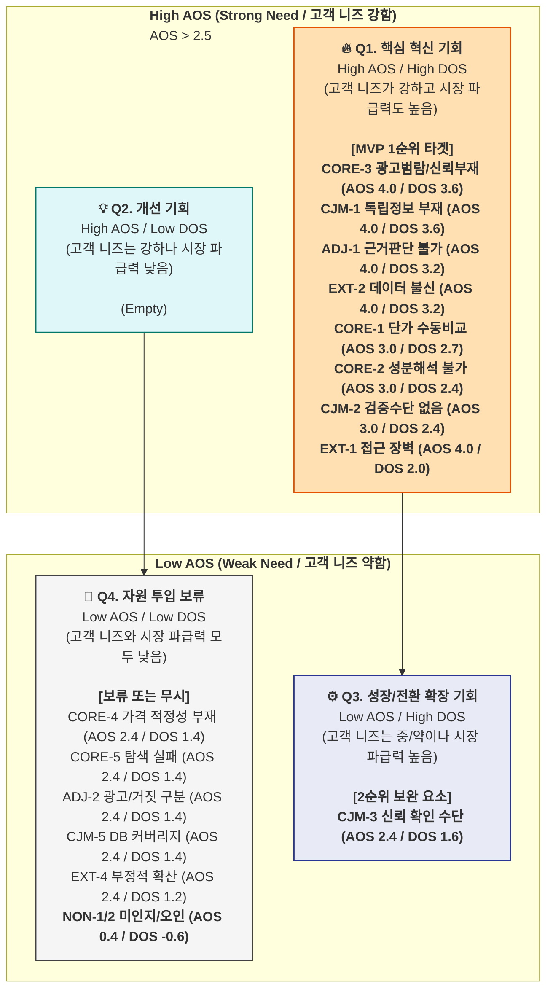

# 건강보조식품 성분·가격 비교 플랫폼: 페르소나 중심 AOS-DOS 종합 분석 보고서

## 1. 개요: 건강보조식품 시장의 미충족 니즈와 기회

본 보고서는 건강보조식품 성분·가격 비교 플랫폼의 성공적인 시장 진입 및 성장을 위한 전략 수립을 목적으로 한다. 6가지 핵심 페르소나 분석과 고객 여정 지도(CJM)를 기반으로 고객의 고충(Pain Point)과 목표(Goal)를 도출하고, 중요도(Importance)와 현재 만족도(Satisfaction)를 평가하여 AOS(Asymmetry of Satisfaction)를 산출하였다. 더 나아가 시장 관련성(Market Relevance)을 가중치로 적용한 DOS(Discovered Opportunity Score)를 통해 시장 파급력을 고려한 최종적인 기회 요인을 식별하고, MVP(Minimum Viable Product) 기능 개발의 우선순위를 제시한다.

## 2. 페르소나별 주요 Pain / Goal 및 AOS 분석

페르소나 분석 결과, 건강보조식품 구매 과정에서 다양한 유형의 고객들이 심각한 미충족 니즈를 경험하고 있음이 확인되었다. 특히 핵심 페르소나(C1, C2)와 확장 페르소나(A2), 극단 페르소나(E1, E2)에서 높은 AOS 점수를 기록하며, 현재 시장에 효과적인 대체 솔루션이 부재함을 시사한다. 비활성 페르소나(N1)는 현 상태에 만족도가 높아 AOS가 매우 낮게 나타났다.

| 그룹 구분 | 페르소나 유형 | Pain ID | 핵심 Pain 내용 | Imp | Sat | AOS |
|:---|:---|:---|:---|:---:|:---:|:---:|
| **🔵 핵심** | **C1 한정훈** (가성비) | CORE-1 | 채널 간 단가 비교 수동 작업 과부하 | 5 | 2 | **3.00** |
| | **C2 박소연** (건강계기) | CORE-2 | 성분 정보 해석 불가 → 비교 불가 | 5 | 2 | **3.00** |
| | **C2 박소연** (건강계기) | CORE-3 | 광고성 콘텐츠 범람, 신뢰 정보 부재 | 5 | 1 | **4.00** |
| | C1/C2 공통 | CORE-4 | 가격 적정성 판단 기준 부재 | 4 | 2 | **2.40** |
| | C2 중심 | CORE-5 | 장시간 탐색에도 확신 있는 결론 실패 | 4 | 2 | **2.40** |
| **🟢 확장** | **A2 정수빈** (트렌드) | ADJ-1 | 트렌드 성분 과학적 근거 판단 불가 | 5 | 1 | **4.00** |
| | **A2 정수빈** (트렌드) | ADJ-2 | 광고/진짜 구분 불가 + 가격 차이 근거 | 4 | 2 | **2.40** |
| | **A2 정수빈** (트렌드) | ADJ-3 | FOMO 충동 구매 → 후회 반복 | 3 | 2 | **1.80** |
| **🔴 극단** | **E1 나경아** (디지털약자)| EXT-1 | 디지털 인터페이스 접근 장벽 | 5 | 1 | **4.00** |
| | **E2 김도현** (신뢰실패) | EXT-2 | 데이터 오류 → 카테고리 전체 불신 | 5 | 1 | **4.00** |
| | **E1 나경아** (디지털약자)| EXT-3 | 수동 검증/홈쇼핑 의존 복귀 | 4 | 3 | **1.60** |
| | **E2 김도현** (신뢰실패) | EXT-4 | 오류·불편의 부정적 확산 | 4 | 2 | **2.40** |
| **⚫ 비활성**| **N1 조미라** (브랜드맹신)| NON-1 | 저가 제품 미인지 + 가격-품질 오인 | 2 | 4 | **0.40** |
| | **N1 조미라** (브랜드맹신)| NON-2 | 정보 방어·거부 + 탐색 니즈 부재 | 1 | 4 | **0.20** |
| **CJM 공통**| 전 여정 | CJM-1 | [인지] 광고 vs 독립 정보 구분 불가 | 5 | 1 | **4.00** |
| | 전 여정 | CJM-2 | [고려] 성분 이해 불가 + 검증 없음 | 5 | 2 | **3.00** |
| | 전 여정 | CJM-3 | [결정] 마지막 신뢰 확인 수단 없음 | 4 | 2 | **2.40** |
| | 전 여정 | CJM-4 | [온보딩] 이력 미저장 → 재방문 초기화 | 3 | 2 | **1.80** |
| | 전 여정 | CJM-5 | [충성도] DB 커버리지 한계 | 4 | 2 | **2.40** |

## 3. Market Relevance 평가 및 DOS 산출

Market Relevance(MR)는 각 Pain Point가 시장 규모(TAM, SAM, SOM) 및 사업의 핵심 목표(수익 기여도, 트래픽 유발성, 확산성)에 미치는 전략적 중요도를 0.1~0.9 사이의 가중치로 평가한 수치이다. DOS는 AOS에 이 MR을 곱하여 산출되며, 고객의 미충족 니즈가 시장에서 갖는 실질적인 기회 가치를 나타낸다.

**Market Relevance 평가 기준:**
*   **높음 (0.8~0.9):** SOM 수익의 55%를 차지하는 Primary 타겟(Q1-A)의 핵심 니즈, 자발적 유입을 이끄는 Secondary 타겟(Q4-A) 및 SEO 유입의 결정적 관문. (예: 광고 범람, 독립 채널 부재, 단가 수동 비교)
*   **중간 (0.6~0.7):** 가격 적정성 확인, DB 커버리지 확보 등 커머스 전환이나 리텐션을 보조하는 기능.
*   **낮음 (0.5 이하):** 비활성 상태이거나 대체재에 만족하는 경우, 또는 간접적인 파급력만 가지는 경우.

| 순위 | Pain ID | 페르소나 분류 | AOS | MR 가중치 | 대상 세그먼트 시장성 종합 평가 | DOS |
|---:|:---|:---|:---:|:---:|:---|---:|
| **1** | **CORE-3** | 🔵 핵심 (C2, C1) | 4.00 | **0.9** | Q1-A + Q4-A 100% 포괄. 전환의 첫 번째 조건 | **3.60** |
| **1** | **CJM-1** | 전 여정 (SEO 인지) | 4.00 | **0.9** | 신규 트래픽의 모든 유입 채널 대응 | **3.60** |
| **3** | **ADJ-1** | 🟢 확장 (A2) | 4.00 | **0.8** | Q4-C 트래픽 규모(트렌드 검색량 폭증) 방어 | **3.20** |
| **3** | **EXT-2** | 🔴 극단 (E2, C1) | 4.00 | **0.8** | C1(수익엔진)의 리텐션을 유지하기 위한 SLA | **3.20** |
| **5** | **CORE-1** | 🔵 핵심 (C1) | 3.00 | **0.9** | MVP 수수료 모델(SAM/SOM)의 55% 수익 직결 | **2.70** |
| **6** | **CORE-2** | 🔵 핵심 (C2) | 3.00 | **0.8** | Q4-A 탐색의 최초 허들. 여기서 통과 못하면 전환 0% | **2.40** |
| **6** | **CJM-2** | 전 여정 (고려 단계) | 3.00 | **0.8** | 미드퍼널 비교 도구 부재 해소 | **2.40** |
| **8** | **EXT-1** | 🔴 극단 (E1) | 4.00 | **0.5** | 모수는 400만 이상이나 직접 결제 확률 매우 낮아 MR 저감 | **2.00** |

## 4. AOS-DOS 결합 매트릭스 및 전략적 시사점

AOS-DOS 매트릭스는 X축(DOS)에 시장 파급력, Y축(AOS)에 고객 미충족 강도를 배치하여, MVP 개발의 우선순위를 시각적으로 제시한다. AOS 2.5, DOS 1.5를 기준으로 4분면을 나눈다.

### AOS-DOS 기회 포트폴리오 

### 사분면별 Pain 배치

| 사분면 | 조건 | 항목 수 | 배치된 Pain |
| :--- | :--- | :--- | :--- |
| 🔥 **Q1 혁신기회** | AOS ≥ 2.5 + DOS ≥ 1.5 | **8개** | CORE-3, CORE-1, CORE-2, ADJ-1, EXT-1, EXT-2, CJM-1, CJM-2 |
| 💡 **Q2 개선기회** | AOS ≥ 2.5 + DOS < 1.5 | **0개** | — |
| ⚙️ **Q3 성장/전환 확장 기회** | AOS < 2.5 + DOS ≥ 1.5 | **1개** | CJM-3 |
| 🚫 **Q4 자원 투입 보류** | AOS < 2.5 + DOS < 1.5 | **10개** | CORE-4·5, ADJ-2·3, EXT-3·4, CJM-4·5, NON-1·2 |

### 매트릭스 주요 시사점

1.  **압도적인 Q1 혁신기회 집중:** 전체 19개 Pain Point 중 8개(약 42%)가 Q1 영역에 집중되어 있다. 이는 건강보조식품 시장이 **고객의 강력한 미충족 니즈와 높은 시장 파급력을 동시에 가진 블루오션**임을 명확히 보여준다. 이 Q1 영역의 Pain 해결에 MVP 역량을 집중해야 한다.
2.  **AOS 최고 ≠ DOS 최고:** `EXT-1(디지털 인터페이스 접근 장벽)`은 AOS 4.0으로 고객 니즈는 매우 높으나, 직접적인 수익 창출 기여도가 낮아 DOS가 2.0으로 낮아졌다. 이는 MVP 이후 점진적으로 개선될 Phase 2 기능으로 분류된다.
3.  **DOS가 AOS 순위를 역전하는 항목:** `CORE-1(채널 간 단가 비교 수동 작업 과부하)`는 AOS 3.0으로 중위권이지만, SOM 수익의 55%를 차지하는 핵심 기능이므로 DOS는 2.70으로 상위권에 랭크되어 MVP 핵심 기능임을 강조한다.
4.  **DOS 음수 = 투자 불필요 확인:** `NON-1(저가 제품 미인지 + 가격-품질 오인)`과 `NON-2(정보 방어·거부 + 탐색 니즈 부재)`는 DOS가 –0.6으로 음수 값을 기록했다. 이는 N1 페르소나가 현재 대체 솔루션(TV 홈쇼핑, 익숙한 브랜드)에 대해 만족하고 있어, 해당 Pain에 대한 직접적인 마케팅 및 기능 투자가 불필요함을 재확인한다.
5.  **독립 비교 플랫폼 정체성 및 SEO의 최우선 과제:** `CORE-3(광고성 콘텐츠 범람, 신뢰 정보 부재)`와 `CJM-1([인지] 광고 vs 독립 정보 구분 불가)`은 AOS와 DOS 모두 최고점을 기록했다. 이는 플랫폼의 '독립성'과 '객관성'이 시장 진입 및 유기적 트래픽 확보의 핵심임을 강력히 시사한다.

## 5. 최종 결론 및 MVP 기능 우선순위

AOS-DOS 결합 매트릭스 분석 결과, MVP는 Q1 '핵심 혁신 기회' 영역에 집중하여 시장 진입의 교두보를 마련해야 한다. 다음은 MVP에 포함되어야 할 4가지 최우선 기능 세트이다.

1.  **독립 선언과 에비던스 기반 정보 제공 (AOS 4.0 / DOS 3.6)**
    *   "광고 없음, 객관적 측정"을 강조하는 플랫폼의 UI/UX 설계.
    *   트렌드 성분에 대한 과학적 근거 등급을 명시한 팩트체크 리포트 및 SNS 공유 기능. (Phase 2에서 확장)
    *   CJM '인지' 단계에서 '광고 아님' 정체성을 명확히 하는 SEO 콘텐츠 선점.

2.  **다중 채널 실시간 환율 기반 단가 자동 계산기 (AOS 3.0 / DOS 2.7)**
    *   iHerb(달러), 쿠팡(원), 네이버 등 주요 커머스 채널의 실시간 환율 및 할인·쿠폰·적립금을 반영한 1정당/1IU당 실제 단가 자동 비교 계산 기능. (C1 한정훈 페르소나의 핵심 Pain 해결)

3.  **전문 용어 한 줄 번역 및 증상별 필터 엔진 (AOS 3.0 / DOS 2.4)**
    *   '콜레칼시페롤 25μg'과 같은 전문 성분명을 '몸에 잘 흡수되는 비타민 D3'와 같은 쉬운 일상어로 번역.
    *   건강검진 결과(이상 소견) 또는 관심 증상에 기반한 제품 필터링 기능. (C2 박소연 페르소나의 정보 과잉 문제 해결)

4.  **오류 실시간 제보 및 데이터 출처 투명 표기 (AOS 4.0 / DOS 3.2)**
    *   모든 제품 정보 하단에 식약처 원본 라벨 또는 공식 판매처 정보 링크를 명시하여 데이터 출처를 투명하게 공개.
    *   사용자가 데이터 오류를 즉시 신고할 수 있는 기능 및 48시간 이내 처리 완료 SLA(Service Level Agreement) 제공. (E2 김도현 페르소나의 '카테고리 불신' 해소 및 플랫폼 신뢰도 확보)

